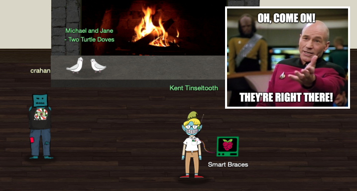

# Talk to Santa & Find the Turtle Doves
**Hint**: none

## Request
> This is a little embarrassing, but I need your help.  
> Our KringleCon turtle dove mascots are missing!  
> They probably just wandered off.  
> Can you please help find them?  
> To help you search for them and get acquainted with KringleCon, I’ve created some objectives for you.  
> You can see them in your badge.  
> Where's your badge? Oh! It's that big, circle emblem on your chest - give it a tap!  
> We made them in two flavors - one for our new guests, and one for those who've attended both KringleCons.  
> After you find the Turtle Doves and complete objectives 2-5, please come back and let me know.  
> Not sure where to start? Try hopping around campus and talking to some elves.  
> If you help my elves with some quicker problems, they'll probably remember clues for the objectives.  

## Resources
- None

## Solution

This objective, together with *Talk to Santa in the Quad*, doesn't require any answers to be submitted as it's meant to set the stage, point you in the right direction, and ensure you visit all areas of Elf University. To complete objective 0 and to learn more about the missing doves talk to Santa in the Quad. Once you've located the doves near the Student Union fireplace and complete objectives 2-5 objective 1 will be marked as completed and Santa will continue the conversation as indicated in the [response section](#response) below.

## Answer
Turtle doves location: `Student Union fireplace`

## Response
> Thank you for finding Jane and Michael, our two turtle doves!  
> I’ve got an uneasy feeling about how they disappeared.  
> Turtle doves wouldn’t wander off like that.  
> Someone must have stolen them! Please help us find the thief!  
> It’s a moral imperative!  
> I think you should look for an entrance to the steam tunnels and solve Challenge 6 and 7 too!  
> Gosh, I can’t help but think:  
> Winds in the East, snow coming in...  
> Like something is brewing and about to begin!  
> Can’t put my finger on what lies in store,  
> But I fear what’s to happen all happened before!  
