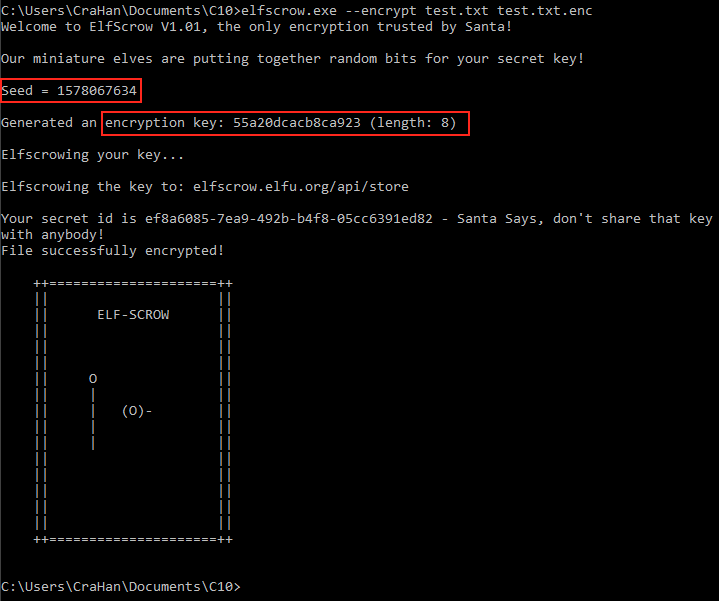
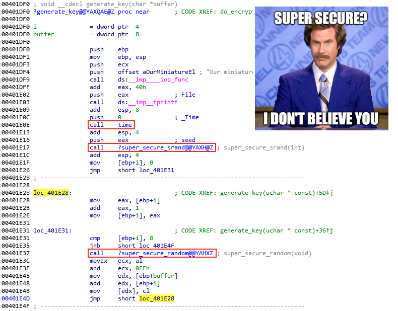
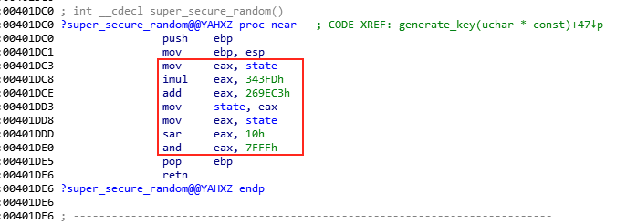
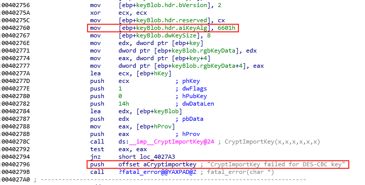

# Recover Cleartext Document
**Hint**: [Holly Evergreen - Mongo Pilfer](../hints/h10.md)

## Request
> The [Elfscrow Crypto](https://downloads.elfu.org/elfscrow.exe) tool is a vital asset used at Elf University for encrypting SUPER SECRET documents.  
> We can't send you the source, but we do have [debug symbols](https://downloads.elfu.org/elfscrow.pdb) that you can use.  
> Recover the plaintext content for this [encrypted document](https://downloads.elfu.org/ElfUResearchLabsSuperSledOMaticQuickStartGuideV1.2.pdf.enc).  
> We know that it was encrypted on December 6, 2019, between 7pm and 9pm UTC.  
> What is the middle line on the cover page? (Hint: it's five words)

## Video
<div class="video-wrapper">
<iframe width="560" height="315" src="https://www.youtube.com/embed/PPbELj4PeKk?start=123" frameborder="0" allow="accelerometer; autoplay; encrypted-media; gyroscope; picture-in-picture" allowfullscreen></iframe>
</div>

## Resources
- [Elfscrow Crypto Binary](https://downloads.elfu.org/elfscrow.exe)
- [Elfscrow Debug Symbols](https://downloads.elfu.org/elfscrow.pdb)
- [Encrypted PDF Document](https://downloads.elfu.org/ElfUResearchLabsSuperSledOMaticQuickStartGuideV1.2.pdf.enc)
- [Ron Bowes, Reversing Crypto the Easy Way](https://youtu.be/obJdpKDpFBA)
- [Reversing Crypto Demo Code & Slides](https://tinyurl.com/kringlecon-crypto)
- [IDA](https://www.hex-rays.com/products/ida/support/download_freeware.shtml)
- [Ghidra](https://www.nsa.gov/resources/everyone/ghidra/) 

## Solution
The most helpful resource for this challenge is defnitely Ron Bowes' [Reversing Crypto the Easy Way](https://youtu.be/obJdpKDpFBA) presentation. It goes over a lot of information and is well worth the time. If you're new to crypto then you'll definitely learn more than a few things (like I did). Start by encrypting a plain text document with the [`elfscrow.exe`](https://downloads.elfu.org/elfscrow.exe) crypto tool and looking at the program output.

```shell
elfscrow.exe --encrypt test.txt test.txt.enc
```



The `elfscrow.exe` application prints the seed, generates and prints the encryption key, encrypts the file, sends the key to the [elfscrow server](https://elfscrow.elfu.org/api/store) for storage, and finally prints a secret ID which can be used to retrieve the key from the server and decrypt the file again. The output provides two additional pieces of information. First, the seed value looks like the current date and time represented in [epoch format](https://www.epochconverter.com). Secondly, the key length is 8 bytes which could indicate DES. 

Open up the `elfscrow.exe` binary and [`elfscrow.pdb`](https://downloads.elfu.org/elfscrow.pdb) debug symbols in IDA to better understand how exactly the tool uses the seed to generate the 8-byte encryption key and what algorithm is being used. Start by looking at the `generate_key` function.



This function first calls `time`, then `super_secure_srand` to initialize the seed, and finally loops 8 times over the `super_secure_random` pseudo-random number generator (PRNG) function to create the 8-byte encryption key. The `super_secure_srand` function doesn't to do much more than print and then store the seed in `state`.


The `super_secure_random` function then takes the seed value stored in `state`, multiplies it by 343FDh (i.e. 214013 in decimal), adds 269EC3h (i.e. 2531011 in decimal), and saves this value in `state` as the new seed value. It continues with bit-shifting the current value, bitwise AND-ing with 7FFFh (i.e. 32767 in decimal), and returning this value as the next key byte. 



Translating `super_secure_random` into Python gives us the below function.

```python
def rand():
    """Generate random value."""
    # 1. get seed value
    # 2. multiply seed by 214013
    # 3. add 2531011 (this is our new seed value)
    # 4. right shift seed by 16
    # 5. bitwise AND with 32767
    global seed
    seed = (214013 * seed + 2531011)
    val = seed >> 16
    return (val & 32767)
```

Doing the same for the `generate_key` function results in the following function.

```python
def generate_key(val):
    """Generate encryption key."""
    global seed
    seed = val
    encrypted = []
    for _x in range(8):
        tmp = hex(rand())
        if len(str(tmp)) == 6:
            encrypted.append(str(tmp)[4:])
        elif len(str(tmp)) == 5:
            encrypted.append(str(tmp)[3:])
        elif len(str(tmp)) == 4:
            encrypted.append(str(tmp)[2:])
        elif len(str(tmp)) == 3:
            encrypted.append(f"0{str(tmp)[-1]}")
    return ''.join(encrypted)
```

Now that we've determined the initial seed value (i.e. epoch time) and replicated the algorithm to generate the 8-byte key, we need to determine what encryption algorithm is used by `elfscrow.exe`. The `do_encrypt` function provides some useful hints.



First there's the obvious "CryptImportKey failed for DES-CBC key" comment. While a comment can contain incorrect information it's confirmed by the [6601h](https://docs.microsoft.com/en-us/windows/win32/seccrypto/alg-id) algorithm ID value (i.e. CALG_DES) which is used as input for the [`CryptImportKey`](https://docs.microsoft.com/en-us/windows/win32/api/wincrypt/nf-wincrypt-cryptimportkey) function. Our initial suspicion that DES is being used based on the 8-byte key length appears to be correct.

The final piece of the puzzle is the hint that the file was encrypted on December 6, 2019, between 7pm and 9pm UTC. This gives us a 7200-second window or 7200 possible seed values starting from 1575658800 (i.e. epoch time for December 6, 2019, 7pm). We can now complete the [`decrypt_pdf.py`](../scripts/decrypt_pdf.py.md) script by adding the following Python code.

```python
def main():
    """Execute."""
    # File names
    encinfile = 'ElfUResearchLabsSuperSledOMaticQuickStartGuideV1.2.pdf.enc'
    pdfoutfile = 'ElfUResearchLabsSuperSledOMaticQuickStartGuideV1.2.pdf'

    # Friday, December 6, 2019 7:00:00 PM
    start = 1575658800

    # Loop over 2 hours and generate the key for each
    for x in range(7200):
        keyseed = start + x
        key = generate_key(keyseed)
        bytekey = bytearray.fromhex(key)

        # Prep for decrypting DES-CBC
        cipher = DES.new(
            bytekey,
            DES.MODE_CBC,
            iv=bytearray.fromhex('0000000000000000')
        )

        # Read encrypted file
        f = open(encinfile, 'rb')
        encrypted = f.read()

        # Decrypt using the current key
        msg = (cipher.iv + cipher.decrypt(encrypted))

        # Check if decryption was successful
        if msg[9:12] == b'PDF':
            # Yes, we got a PDF!
            print(f'Pass {x}: {key} decrypts to a PDF!')
            f = open(pdfoutfile, 'wb')
            f.write(msg)
            break
        else:
            # Womp womp! On to the next.
            print(f'Pass {x}: {key} is no bueno!')
```

All 7200 possible seeds are used to generate the associated keys. Each key is then used to decrypt the file and if the decrypted file header indicates it's a PDF file we know the decryption was successful, in which case we break out of the loop.


The correct key is found on attempt 4850 which tells us the file was encrypted on Friday, December 6, 2019 8:20:50 PM.


Sweet! [Super Sled-O-Matic quick-start guide v1.2](../files/ElfUResearchLabsSuperSledOMaticQuickStartGuideV1.2.pdf) successfully decrypted! Someone needs to have a serious talk with Santa and explain to him that ElfScrow version 1.01 is in urgent need of an update though. Way too much DES and PRNG shenanigans and I'd have some serious reservations slapping my name on the whole 'the only encryption trusted by Santa!' tagline if I were him.

## Answer
Middle line on the cover page: `Machine Learning Sleigh Route Finder`

## Hint
None
