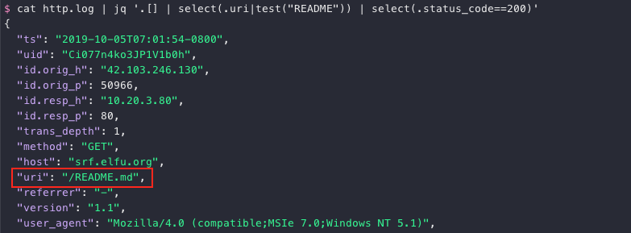
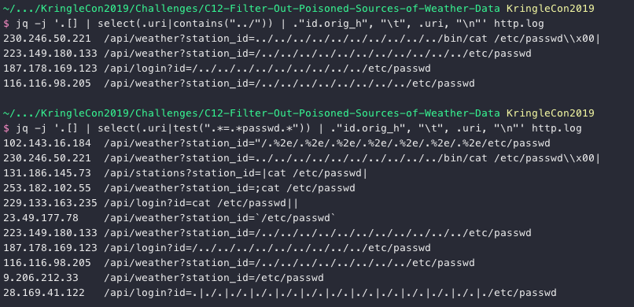
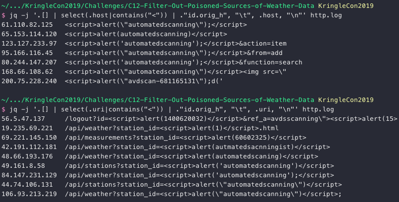
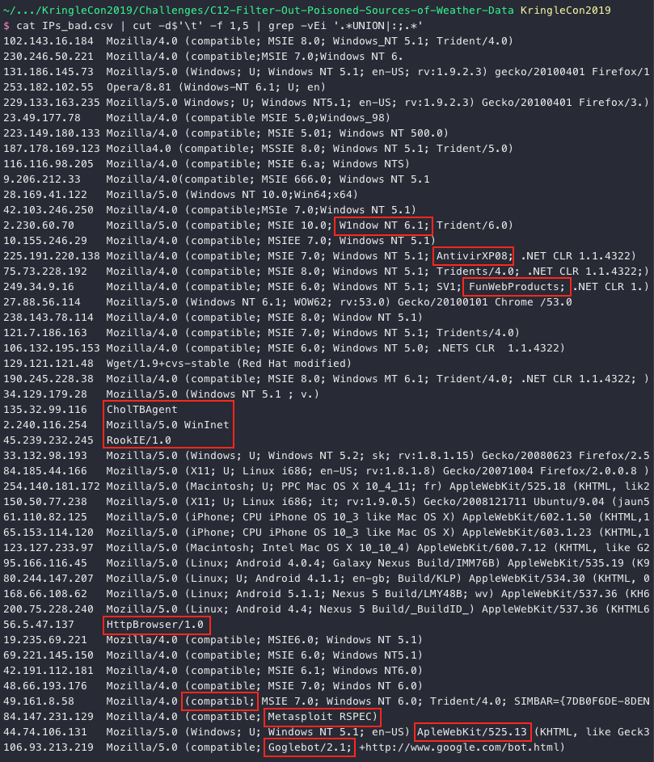
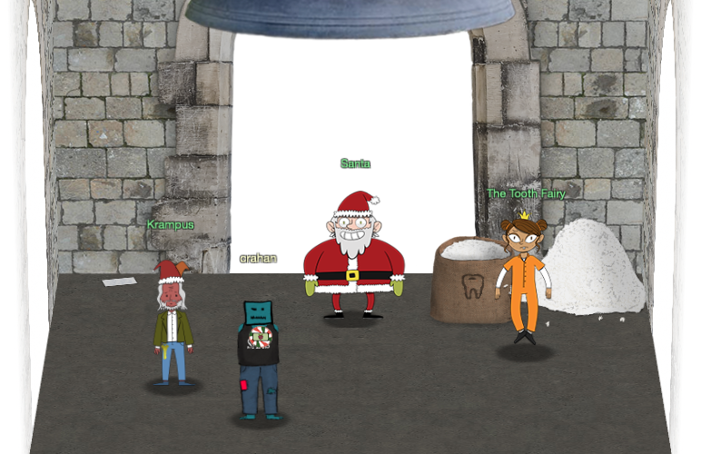

# Filter Out Poisoned Data Sources
**Hint**: [Wunorse Openslae - Zeek JSON Analysis](../hints/h12.md)

## Request
> Use the data supplied in the [Zeek JSON logs](https://downloads.elfu.org/http.log.gz) to identify the IP addresses of attackers poisoning Santa's flight mapping software. [Block the 100 offending sources](https://srf.elfu.org/) of information to guide Santa's sleigh through the attack.  
> Submit the Route ID ("RID") success value that you're given.  
> For hints on achieving this objective, please visit the Sleigh Shop and talk with Wunorse Openslae.

## Resources
- [Zeek JSON logs](https://downloads.elfu.org/http.log.gz)
- [Parsing Zeek JSON Logs with JQ](https://pen-testing.sans.org/blog/2019/12/03/parsing-zeek-json-logs-with-jq-2)
- [Sleigh Route Finder API](https://srf.elfu.org/)
- [Local File Inclusion (LFI)](https://www.owasp.org/index.php/Testing_for_Local_File_Inclusion)
- [Cross-Site Scripting (XSS)](https://www.owasp.org/index.php/Cross-site_Scripting_(XSS))
- [SQL Injection (SQLi)](https://www.owasp.org/index.php/SQL_Injection)
- [ShellShock](https://en.wikipedia.org/wiki/Shellshock_(software_bug))

## Solution
Before diving into the [Zeek JSON logs](https://downloads.elfu.org/http.log.gz) and finding all the bad activity we first need log in to the [Sleigh Route Finder API](https://srf.elfu.org/) website. The [Super Sled-O-Matic quick-start guide](../files/ElfUResearchLabsSuperSledOMaticQuickStartGuideV1.2.pdf) provides information on where we can find the login credentials, stating *"The default login credentials should be changed on startup and can be found in the readme in the ElfU Research Labs git repository."*

Git readme files are typically named `README.md` so search the logs for that particular string.

```shell
cat http.log | jq '.[] | select(.uri|test("README")) | select(.status_code==200)'
```



Download [`README.md`](https://srf.elfu.org/README.md). The default admin credentials are `admin 924158F9522B3744F5FCD4D10FAC4356`.


Now that we have access to the Sleigh Route Finder API we can start going through the logs to find all the IP addresses responsible for the bad activity. Wunorse tells us we might want to look for [LFI](https://www.owasp.org/index.php/Testing_for_Local_File_Inclusion), [XSS](https://www.owasp.org/index.php/Cross-site_Scripting_(XSS)), [SQLi](https://www.owasp.org/index.php/SQL_Injection), and [Shellshock](https://en.wikipedia.org/wiki/Shellshock_(software_bug)). Remember to search more than just the `uri` field for these exploits. `host`, `user_agent`, and `username` can also contain interesting artifacts. Let's kick things off with [Local File Inclusion (LFI)](https://www.owasp.org/index.php/Testing_for_Local_File_Inclusion). To keep things clean the output is limited to just the source IP and the field being searched.

```shell
jq -j '.[] | select(.uri|contains("../")) | ."id.orig_h", "\t", .uri, "\n"' http.log
jq -j '.[] | select(.uri|test(".*=.*passwd.*")) | ."id.orig_h", "\t", .uri, "\n"' http.log
```



We have our first set of 11 bad IPs. Moving on to [SQL Injection (SQLi)](https://www.owasp.org/index.php/SQL_Injection).

```shell
jq -j '.[] | select(.uri|contains("UNION")) | ."id.orig_h", "\t", .uri, "\n"' http.log
jq -j '.[] | select(.user_agent|contains("UNION")) | ."id.orig_h", "\t", .user_agent, "\n"' http.log
jq -j '.[] | select(.username|contains("1=1")) | ."id.orig_h", "\t", .username, "\n"' http.log
```


29 results. Quite the haul! Next up, [Shellshock](https://en.wikipedia.org/wiki/Shellshock_(software_bug)).

```shell
jq -j '.[] | select(.user_agent|contains(":;")) | ."id.orig_h", "\t", .user_agent, "\n"' http.log
```


6 additional IPs. Last but not least, [Cross-Site Scripting (XSS)](https://www.owasp.org/index.php/Cross-site_Scripting_(XSS)).

```shell
jq -j '.[] | select(.host|contains("<")) | ."id.orig_h", "\t", .host, "\n"' http.log
jq -j '.[] | select(.uri|contains("<")) | ."id.orig_h", "\t", .uri, "\n"' http.log
```



With the XSS results we now have a total of 62 IP addresses. Not enough to cover all of the malicious traffic unfortunately. To find more IPs we need to use information from the current set and match those with other, less obvious log entries. Take a look at the User-Agent strings for the [IP addresses](../files/IPs_bad.csv) we found so far.

```shell
cat IPs_bad.csv | cut -d$'\t' -f 1,5 | grep -vEi '.*UNION|:;.*'
```



While not all of these jump out as suspicious, a few definitely do. The below [Python script](../scripts/match_user_agents.py.md) takes 2 CSV files with `id.orig_h`, `host`, `username`, `uri`, and `user_agent` fields from the Zeek logs as input. One log containing only the bad IPs and the other containing everything. If we find more than 3 matches for a specific IP address (i.e. more than 2 additional values) then chances are we're including legitimate traffic so we ignore those just to be on the safe side.

```python
#!/usr/bin/env python3
"""Find matching user_agent strings."""


def main():
    """Execute."""
    file_bad = 'IPs_bad.csv'
    file_all = 'IPs_all.csv'
    list_bad = []
    list_all = []

    # Read the full data log
    with open(file_all) as fp:
        line = fp.readline()

        while line:
            list_all.append(line.split('\t'))
            line = fp.readline()

    # Read the bad IP data and match on user_agent but only
    # keep the results if less than 4 matches are found.
    with open(file_bad) as fp:
        line = fp.readline()

        while line:
            tmp = []
            line_bad = line.split('\t')

            for line_all in list_all:
                if line_all[4] == line_bad[4]:
                    tmp.append(line_all[0])

            # Only add if less than 4 matches
            if len(tmp) < 4:
                list_bad.extend(tmp)

            # Add the original IP as well
            list_bad.append(line_bad[0])
            line = fp.readline()

    # Remove duplicates
    list_bad = list(dict.fromkeys(list_bad))

    # Tadaaaaa!
    print(f'Found {len(list_bad)} IPs: {",".join(list_bad)}')


if __name__ == "__main__":
    main()
```


We only have 97 IPs, but let's give it a shot anyway. Take the CSV data and deny it on the [SRF firewall](https://srf.elfu.org/home.html#contact).


The RID seems to be made up of 2 dates, 08-07-1985 and 08-26-1964, but I'm not sure what they signify. Enter the Bell Tower and meet up with Santa, Krampus, and the Tooth Fairy. In the top left corner you'll also find a [final note](../misc/interesting_ui.md#jack-frost-kringlecon-3). Roll credits!



## Answer
RID: `0807198508261964` 

## Hint
> Krampus:  
> Congratulations on a job well done!  
> Oh, by the way, I won the Frido Sleigh contest.  
> I got 31.8% of the prizes, though I'll have to figure that out.  
>  
> Santa:  
> You did it! Thank you! You uncovered the sinister plot to destroy the holiday season!  
> Through your diligent efforts, we’ve brought the Tooth Fairy to justice and saved the holidays!  
> Ho Ho Ho!  
> The more I laugh, the more I fill with glee.  
> And the more the glee,  
> The more I'm a merrier me!  
> Merry Christmas and Happy Holidays.  
>  
> The Tooth Fairy:  
> You foiled my dastardly plan! I’m ruined!  
> And I would have gotten away with it too, if it weren't for you meddling kids!
