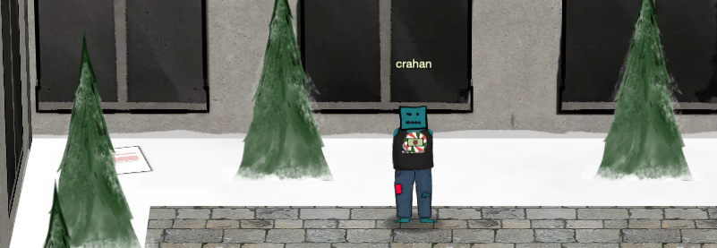
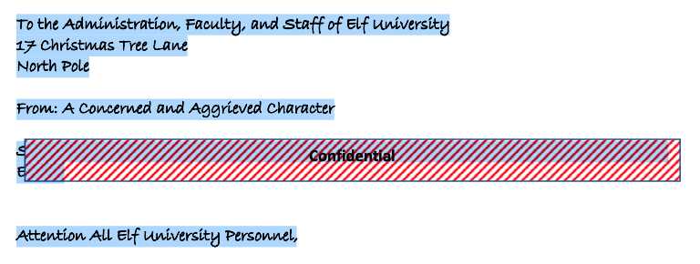

# Unredact Threatening Document
**Hint**: none

## Request
> Someone sent a [threatening letter](https://downloads.elfu.org/LetterToElfUPersonnel.pdf) to Elf University.  
> What is the first word in ALL CAPS in the subject line of the letter?  
> Please find the letter in the Quad.  

## Video
<div class="video-wrapper">
<iframe width="560" height="315" src="https://www.youtube.com/embed/PmHcVRry17w?start=242" frameborder="0" allow="accelerometer; autoplay; encrypted-media; gyroscope; picture-in-picture" allowfullscreen></iframe>
</div>

## Resources
- [Threatening letter](https://downloads.elfu.org/LetterToElfUPersonnel.pdf)

## Solution
The letter can be found in the top left corner of the Quad, sticking out from behind a tree.



Open `LetterToElfUPersonnel.pdf` and select all text.



Copy the selection and paste it into a new plaintext document.

```text
Date: February 28, 2019
To the Administration, Faculty, and Staff of Elf University 17 Christmas Tree Lane North Pole
From: A Concerned and Aggrieved Character
Subject: DEMAND: Spread Holiday Cheer to Other Holidays and Mythical Characters... OR ELSE!

Attention All Elf University Personnel,

It remains a constant source of frustration that Elf University and the entire operation at the 
North Pole focuses exclusively on Mr. S. Claus and his year-end holiday spree. We URGE you to 
consider lending your considerable resources and expertise in providing merriment, cheer, toys,
candy, and much more to other holidays year-round, as well as to other mythical characters.

For centuries, we have expressed our frustration at your lack of willingness to spread your
cheer beyond the inaptly-called “Holiday Season.” There are many other perfectly fine holidays
and mythical characters that need your direct support year-round.

If you do not accede to our demands, we will be forced to take matters into our own hands. We do
not make this threat lightly. You have less than six months to act demonstrably.

Sincerely,

--A Concerned and Aggrieved Character
```

'DEMAND' is the first word in ALL CAPS in the subject line of the threatening letter. I do wonder about that date though. Was it really sent on February 28, 2019? Who redacted it? How long has it been lying behind a tree in a corner of the quad like that? Did no one notice it being there? Did no one care? What is the air-speed velocity of an unladen swallow?

## Answer
Word: `DEMAND`

## Hint
None
