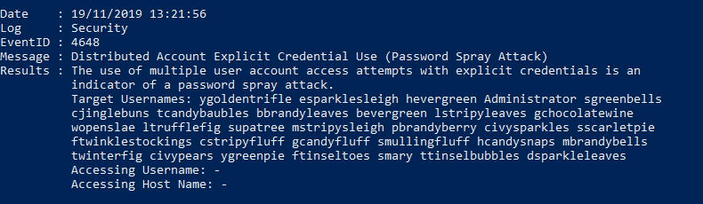
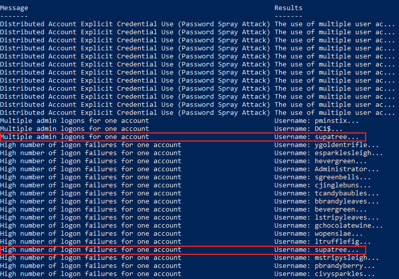

# Evaluate Attack Outcome
**Hint**: [Bushy Evergreen - "Escape Ed"](../hints/h3.md)

## Question
> We're seeing attacks against the Elf U domain!  
> Using the [event log data](https://downloads.elfu.org/Security.evtx.zip), identify the user account that the attacker compromised using a password spray attack.  
> Bushy Evergreen is hanging out in the train station and may be able to help you out.

## Resources
- [Event log data](https://downloads.elfu.org/Security.evtx.zip)
- [DeepBlueCLI Github](https://github.com/sans-blue-team/DeepBlueCLI)
- [DeepBlueCLI: a PowerShell Module for Hunt Teaming via Windows Event Logs](https://www.ericconrad.com/2016/09/deepbluecli-powershell-module-for-hunt.html)

## Solution
Start by cloning or downloading the [DeepBlueCLI](https://github.com/sans-blue-team/DeepBlueCLI) Git repository. During a password spray attack the attacker tries the same password across a number of different accounts. When the security event log contains a high number of logon failures in combination with a succesful logon for the same account the attack was likely successful. Run `DeepBlue.ps1` against the provided log file.

```powershell
 .\DeepBlue.ps1 ..\Security.evtx | Sort-Object -Property Date | Format-List
```



DeepBlueCLI finds evidence of the password spray attack and provides a list of 31 targeted usernames but the output is a little hard to digest. Run `DeepBlue.ps1` again, this time formatting the output as a table to make things a little easier to read.

```powershell
.\DeepBlue.ps1 ..\Security.evtx | Format-Table Message,Results
```



Out of the three accounts that had successful logons `supatree` is the only one that's also showing up in the list of 31 entries with a high number of failed logon attempts. It looks like Shinny Upatree's account is the one that was compromised.

## Answer
Account: `supatree`

## Hint
None
