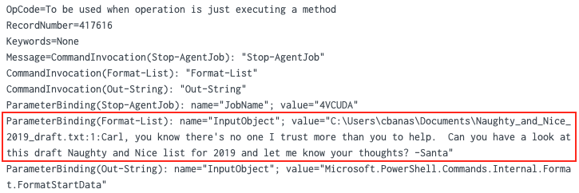
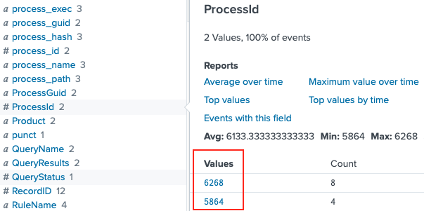
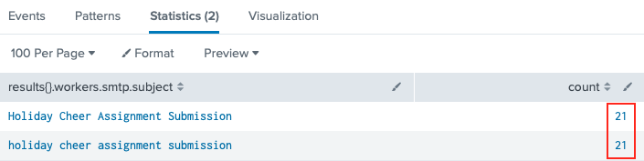
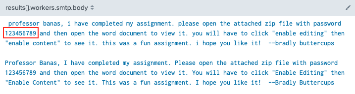

# Splunk
**Hint**: [Tangle Coalbox - "Frosty Keypad"](../hints/h6.md)

## Request
> Hi, I'm Dr. Banas, professor of Cheerology at Elf University.  
> This term, I'm teaching "HOL 404: The Search for Holiday Cheer in Popular Culture," and I've had quite a shock!  
> I was at home enjoying a nice cup of Gløgg when I had a call from Kent, one of my students who interns at the Elf U SOC.  
> Kent said that my computer has been hacking other computers on campus and that I needed to fix it ASAP!  
> If I don't, he will have to report the incident to the boss of the SOC.  
> Apparently, I can find out more information from this [website](https://splunk.elfu.org/) with the username: elf / Password: elfsocks.  
> I don't know anything about computer security. Can you please help me?

## Resources
- [Elf University Splunk](https://splunk.elfu.org/)

## Solution
### Question 1
*"Question 1"*

Explanation.

```shell
index=main cbanas
```


**Answer**: `sweetums`

### Question 2
*"Question 2"*

Explanation.

```shell
index=main santa
```



**Answer**: `C:\Users\cbanas\Documents\Naughty_and_Nice_2019_draft.txt` 

### Question 3
*"Question 3"*

Explanation.

```shell
index=main powershell EventCode=3
```


**Answer**: `144.202.46.214.vultr.com` 

### Question 4
*"Question 4"*

Explanation.

```shell
index=main sourcetype="WinEventLog:Microsoft-Windows-Powershell/Operational" | reverse
```


Click on the first result to pivot to a 10-second time range search

```shell
index=main source="WinEventLog:Microsoft-Windows-Sysmon/Operational"
```



Finds ProcessId 5864 and 6268  
Convert to hex: 5864 is 0x16E8, 6268 is 0x187C  
Remove time range restriction again (i.e. select 'All time')

```shell
index=main sourcetype=WinEventLog EventCode=4688 (process_id=0x16e8 OR process_id=0x187c)
```


**Answer**: `19th Century Holiday Cheer Assignment.docm`

### Question 5
*"Question 5"*

Explanation.

```shell
index=main sourcetype=stoq "results{}.workers.smtp.subject"="Holiday Cheer Assignment Submission" | 
    stats count by results{}.workers.smtp.subject
```



**Answer**: `21`

### Question 6
*"Question 6"*

Explanation.

```shell 
index=main sourcetype=stoq "results{}.workers.smtp.body"=*password* |
    table results{}.workers.smtp.from results{}.workers.smtp.subject results{}.workers.smtp.body
```



**Answer**: `123456789`

### Question 7
*"Question 7"*

Explanation.

**Answer**: `bradly.buttercups@eifu.org`

### Challenge
1. Start with `index=main sourcetype=stoq "results{}.workers.smtp.from"="bradly buttercups <bradly.buttercups@eifu.org>"`
2. Copy the JSON into VSCode and clean it
3. Search for '.docm' (screenshot10.png) and find:
   "path": "/home/ubuntu/archive/c/6/e/1/7/c6e175f5b8048c771b3a3fac5f3295d2032524af"
4. Download http://elfu-soc.s3-website-us-east-1.amazonaws.com/?prefix=stoQ%20Artifacts/home/ubuntu/archive/c/6/e/1/7/
5. When you extract this file and look at docProps/core.xml it has the wrong data
6. Run `index=main sourcetype=stoq  "results{}.workers.smtp.from"="bradly buttercups <bradly.buttercups@eifu.org>" | eval results = spath(_raw, "results{}") | mvexpand results | eval path=spath(results, "archivers.filedir.path"), filename=spath(results, "payload_meta.extra_data.filename"), fullpath=path."/".filename | search fullpath!="" | table filename,fullpath` (screenshot11.png) and find the core.xml in the results at /home/ubuntu/archive/f/f/1/e/a/ff1ea6f13be3faabd0da728f514deb7fe3577cc4/core.xml
7. Download http://elfu-soc.s3-website-us-east-1.amazonaws.com/?prefix=stoQ%20Artifacts/home/ubuntu/archive/f/f/1/e/a/ff1ea6f13be3faabd0da728f514deb7fe3577cc4/core.xml (screenshot12.png)
8. The message reads: "Kent you are so unfair. And we were going to make you the king of the Winter Carnival." (screenshot13.png)

## Answer
1. `sweetums`
2. `C:\Users\cbanas\Documents\Naughty_and_Nice_2019_draft.txt`
3. `144.202.46.214.vultr.com`
4. `19th Century Holiday Cheer Assignment.docm`
5. `21`
6. `123456789`
7. `bradly.buttercups@eifu.org`
8. `Kent you are so unfair. And we were going to make you the king of the Winter Carnival.`

## Hint
> Oh, thanks so much for your help! Sorry I was freaking out.  
> I've got to talk to Kent about using my email again...  
> ...and picking up my dry cleaning.
