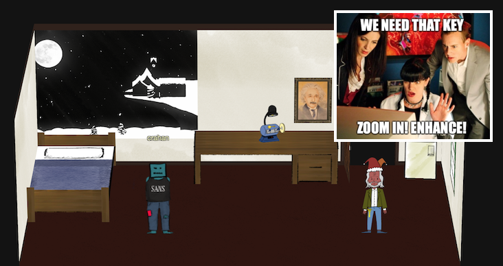
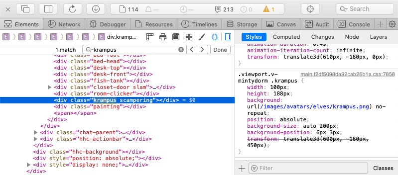
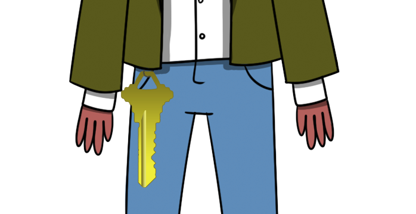
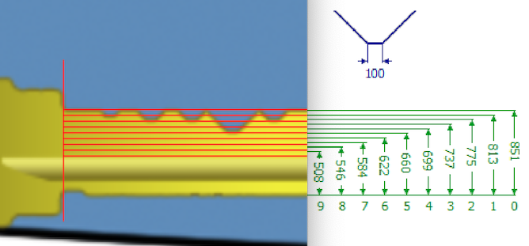
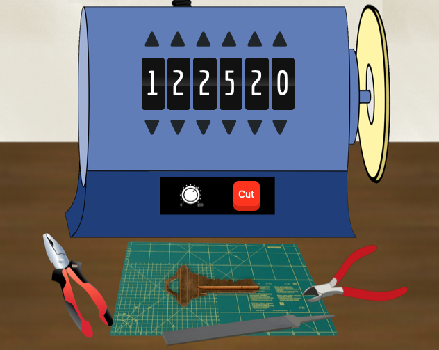
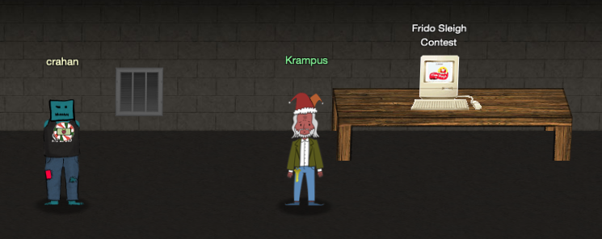

# Get Access to the Steam Tunnels
**Hint**: [Minty Candycane - "Holiday Hack Trail"](../hints/h7.md)

## Request
> Gain access to the steam tunnels. Who took the turtle doves? Please tell us their first and last name. For hints on achieving this objective, please visit Minty's dorm room and talk with Minty Candy Cane.

## Resources
- [Key Decoding](https://github.com/deviantollam/decoding)
- [Optical Decoding of Keys](https://www.youtube.com/watch?v=KU6FJnbkeLA&feature=youtu.be)

## Solution
To enter the steam tunnels we need to copy the right key and use it with the lock in the dorm room closet. When you enter the dorm room a mysterious figure with a key hanging from his belt will linger for a few seconds and then run away into the closet. No matter the amount of zooming and enhancing, the key resolution is far too low to be useful. We need to find a better image.

Each elf has their own specific CSS class and avatar image (there's even a few [elves](../misc/interesting_ui.md#unused-elves) and [toy soldiers](../misc/interesting_ui.md#toy-elf-soldiers) which are listed in the CSS but don't seem to appear in the game itself). For example, the class and associated image for Minty's avatar are shown below.

Additionally, the HTML for Minty's room contains a div titled `krampus_scampering` with a `krampus.png` background image that is stored in the same location as the other elf avatars, `/images/avatars/elves/`.

Unlike other avatars that are low res though, `krampus.png` has quite a [high resolution](https://2019.kringlecon.com//images/avatars/elves/krampus.png) (i.e. 881 × 1950 pixels)

Now look at the different measurements in the [Key Decoding](https://github.com/deviantollam/decoding) Github repository to identify the correct key type. I skipped this step and just winged it by drawing evenly spaced horizontal lines on the key image using the first and second cut as a reference (see the image below). I was fairly certain about cuts 1, 2, 3, and 5, but the fourth cut was off by one. Tweaking it slightly gave me a working key. That said, the [Schlage](https://github.com/deviantollam/decoding/blob/master/Key%20Measurments/Key%20Measurments%20-%20Schlage.png) template provides the correct measurements and will allow you to make a good copy on the first try.

Use the key grinder in Minty's dorm room, enter `122520` for the cuts, and giggle at the *bzzzzt... ting!* sound effect.

Download the `122520.png` file and use it on the lock in the dorm room closet. A hidden door will open, revealing a message on the wall that reads 'This is it'. Follow the steam tunnels to meet up with the mysterious figure you first saw running away in Minty's room.

He'll introduce himself as Krampus Hollyfeld and explain why he borrowed Jane and Michael.

## Answer
Who took the doves: `Krampus Hollyfeld`

## Hint
> Hello there! I’m Krampus Hollyfeld.  
> I maintain the steam tunnels underneath Elf U,  
> Keeping all the elves warm and jolly.  
> Though I spend my time in the tunnels and smoke,  
> In this whole wide world, there's no happier bloke!  
> Yes, I borrowed Santa’s turtle doves for just a bit.  
> Someone left some scraps of paper near that fireplace, which is a big fire hazard.  
> I sent the turtle doves to fetch the paper scraps.  
> But, before I can tell you more, I need to know that I can trust you.  
> Tell you what – if you can help me beat the Frido Sleigh contest (Objective 8), then I'll know I can trust you.  
> The contest is here on my screen and at [fridosleigh.com](https://fridosleigh.com/).  
> No purchase necessary, enter as often as you want, so I am!  
> They set up the rules, and lately, I have come to realize that I have certain materialistic, cookie needs.  
> Unfortunately, it's restricted to elves only, and I can't bypass the CAPTEHA.  
> (That's Completely Automated Public Turing test to tell Elves and Humans Apart.)  
> I've already cataloged [12,000 images](https://downloads.elfu.org/capteha_images.tar.gz) and decoded the [API interface](https://downloads.elfu.org/capteha_api.py).  
> Can you help me bypass the CAPTEHA and submit lots of entries?
