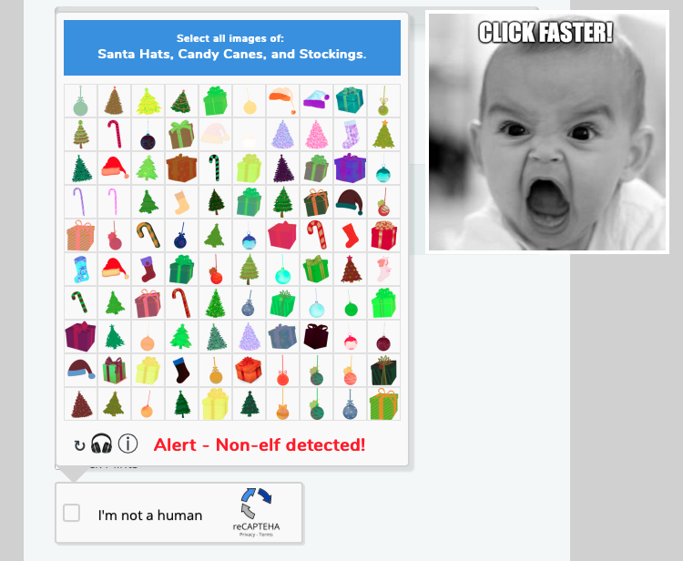
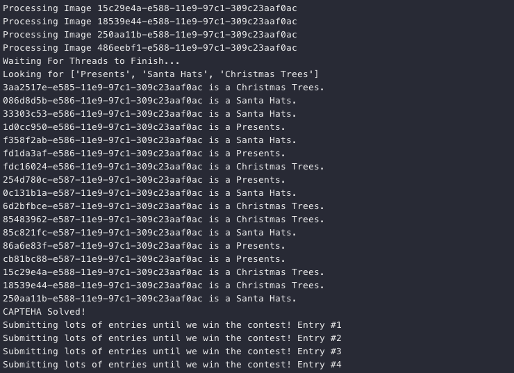
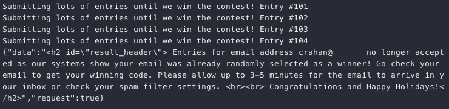
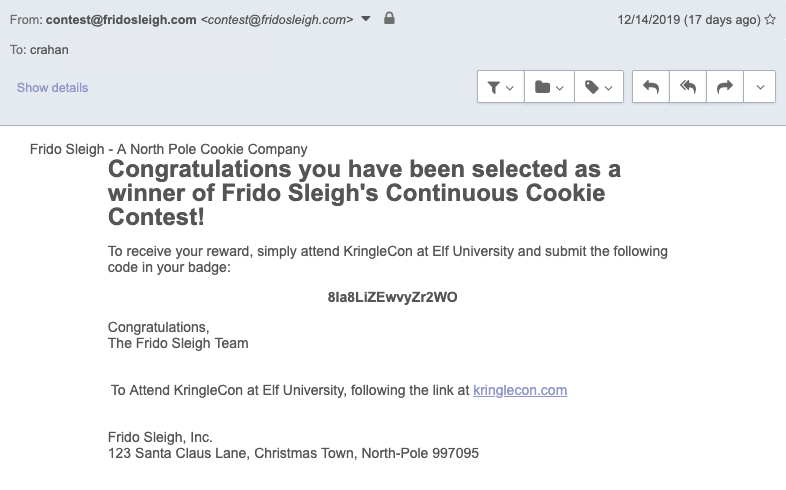

# Bypassing the Frido Sleigh CAPTEHA
**Hint**: [Alabaster Snowball - "Nyanshell"](../hints/h8.md)

## Request
> Help Krampus beat the [Frido Sleigh contest](https://fridosleigh.com/).  
> For hints on achieving this objective, please talk > with Alabaster Snowball in the Speaker Unpreparedness Room.  
>  
> Krampus:   
> The contest is here on my screen and at [fridosleigh.com](https://fridosleigh.com/).  
> No purchase necessary, enter as often as you want, so I am!  
> They set up the rules, and lately, I have come to realize that I have certain materialistic, cookie needs.  
> Unfortunately, it's restricted to elves only, and I can't bypass the CAPTEHA.  
> (That's Completely Automated Public Turing test to tell Elves and Humans Apart.)  
> I've already cataloged [12,000 images](https://downloads.elfu.org/capteha_images.tar.gz) and decoded the [API interface](https://downloads.elfu.org/capteha_api.py).  
> Can you help me bypass the CAPTEHA and submit lots of entries?

## Resources
- [fridosleigh.com](https://fridosleigh.com/)
- [Image Training Data](https://downloads.elfu.org/capteha_images.tar.gz)
- [CAPTEHA API interface](https://downloads.elfu.org/capteha_api.py)
- [TensorFlow Machine Learning Demo Code](https://github.com/chrisjd20/img_rec_tf_ml_demo)
- [Chris Davis, Machine Learning Use Cases for Cybersecurity](https://youtu.be/jmVPLwjm_zs)

## Solution
Buckle up as we just reached the difficulty 4 and 5 challenges. Free Frido Sleigh cookies for life sounds like a pretty sweet deal, except for one minor issue. The form contains one of those super annoying [CAPTEHA](https://fridosleigh.com/about_CAPTEHA.html) tests.

*"A “CAPTEHA” is a Turing test to tell elves and humans apart. It is easy for an elf to solve because elves are magical creatures that work on holiday related objects year-round and can spot and click hundreds of holiday items per second. However, non-elves (like humans) will find it nearly impossible to visualize, correctly identify and click holiday items fast enough before the time runs out."*



In order to get around this we need a script that grabs the CAPTEHA data from [fridosleigh.com](https://fridosleigh.com/), loops over all 100 images, selects the correct types, submits the final selection, and finally spams the hell out of the Frido Sleigh contest form. Luckily, all of the steps required, except for the image prediction portion, are already handled by the [`capteha_api.py`](https://downloads.elfu.org/capteha_api.py) script we receive from Krampus.

For the image processing and prediction step, download and unpack the [12,000 images](https://downloads.elfu.org/capteha_images.tar.gz) and clone or download the [TensorFlow Machine Learning Demo](https://github.com/chrisjd20/img_rec_tf_ml_demo) Github repository. Follow the demo instructions to install the required Python packages.

```shell
git clone https://github.com/chrisjd20/img_rec_tf_ml_demo.git
cd img_rec_tf_ml_demo
sudo apt install python3 python3-pip -y
sudo python3 -m pip install --upgrade pip
sudo python3 -m pip install --upgrade setuptools
sudo python3 -m pip install --upgrade tensorflow==1.15
sudo python3 -m pip install tensorflow_hub
```

Next, train the TensorFlow Machine Learning model by running the [`retrain.py`](https://github.com/chrisjd20/img_rec_tf_ml_demo/blob/master/retrain.py) script and providing the image folder as input. Depending on the hardware resources available this could create problems later on. On some hardware and with the default model it can take longer than 10 seconds to check each of the 100 images and fail the test as a result. The documentation at the top of the `retrain.py` script provides a possible solution though.

*"By default this script will use the highly accurate, but comparatively large and slow Inception V3 model architecture. It's recommended that you start with this to validate that you have gathered good training data, but if you want to deploy on resource-limited platforms, you can try the `--tfhub_module` flag with a Mobilenet model."*

The default 299 x 299 image resolution used in `retrain.py` far exceeds what we need for the smaller CAPTEHA image data. A [Mobilenet model](https://research.googleblog.com/2017/06/mobilenets-open-source-models-for.html) with a smaller image size (i.e. 128 x 128) is more than enough and will, as the `retrain.py` documentation describes, give us faster speeds. Train the TensorFlow Machine Learning model using the sample images provided by Krampus and the proper Mobilenet model (i.e. 100 neurons and 128 input image size) as input.

```shell
 python retrain.py --image_dir ./training_images --tfhub_module \
 https://tfhub.dev/google/imagenet/mobilenet_v1_100_128/quantops/feature_vector/3
```

Once training is complete grab all the functions and remaining code from the [`predict_images_using_trained_model.py`](https://github.com/chrisjd20/img_rec_tf_ml_demo/blob/master/predict_images_using_trained_model.py) demo script and add them to `capteha_api.py`. Be sure to update both the `input_height` and `input_width` parameters in the `read_tensor_from_image_bytes` function to match the value defined by the selected Mobilenet model as well. The [final script](../scripts/capteha_api.py.md) can be found in the 'Scripts' section, but a few code snippets from the `main` function are highlighted below. 

Request a CAPTEHA, store the image data, and parse out the image types we need to select.

```python
url = "https://fridosleigh.com/"

# Create session
s = requests.Session()

# Get CAPTEHA images and types
r = s.post(f'{url}api/capteha/request')
if (r.json()['request']):
    images = r.json()['images']
    types = [x.strip() for x in r.json()['select_type'].split(',')]
    types[-1] = types[-1].replace('and ', '')
```

Next, iterate over the images and for each image extract the UUID, convert the BASE64 image data to binary, and use both as input to process and predict the image. Wait for all processing to finish (i.e. the queue size matches the number of images) and create a list containing the final prediction results.

```python
# Can use queues and threading to spead up the processing
q = queue.Queue()

# Going to interate over each of our images.
for image in images:
    img_uuid = image['uuid']
    img_base64 = image['base64']
    print('Processing Image {}'.format(img_uuid))

    # We don't want to process too many images at once. 10 threads max
    while len(threading.enumerate()) > 10:
        time.sleep(0.0001)

    # Predict_image function is expecting png image bytes so we read
    # image as 'rb' to get a bytes object
    image_bytes = base64.b64decode(img_base64)
    threading.Thread(
        target=predict_image,
        args=(
            q,
            sess,
            graph,
            image_bytes,
            img_uuid,
            labels,
            input_operation,
            output_operation
        )
    ).start()

print('Waiting For Threads to Finish...')
while q.qsize() < len(images):
    time.sleep(0.001)

# Getting a list of all threads returned results
prediction_results = [q.get() for x in range(q.qsize())]
```

Loop over the prediction results and, if an image matches a requested type, add its UUID to the `answers` list.

```python
answers = []

# What are we looking for?
print(f'Looking for {types}')

# Get the matching images
for prediction in prediction_results:
    if prediction['prediction'] in types:
        print(f"{prediction['img_uuid']} is a {prediction['prediction']}.")
        answers.append(prediction['img_uuid'])

final_answer = ','.join(answers)
```

The remainder of Krampus' `capteha_api.py` script submits the list of UUIDs and, if successful, sends the Frido Sleigh form over and over again until a response is returned informing us we won. Be sure to replace `yourREALemailAddress` with a working email address though as the system needs to be able to send out a confirmation email. 





Looks like our winning Frido Sleigh Continuous Cookie Contest code is `8Ia8LiZEwvyZr2WO`.

## Answer
Email code: `8Ia8LiZEwvyZr2WO`

## Hint
> You did it! Thank you so much. I can trust you!  
> To help you, I have flashed the firmware in your badge to unlock a useful new feature:  
> magical teleportation through the steam tunnels.  
> As for those scraps of paper, I scanned those and put the images on my server.  
> I then threw the paper away.  
> Unfortunately, I managed to lock out my account on the server.  
> Hey! You’ve got some great skills. Would you please hack into my system and retrieve the scans?  
> I give you permission to hack into it, solving Objective 9 in your badge.  
> And, as long as you're traveling around, be sure to solve any other challenges you happen across.
