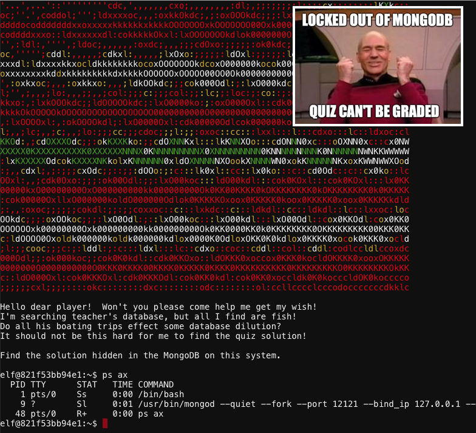
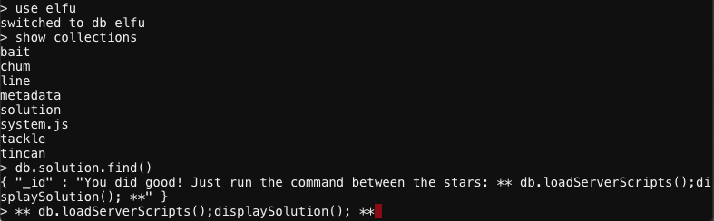
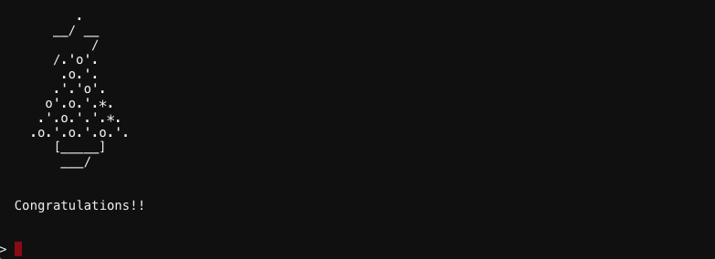

# Holly Evergreen - "Mongo Pilfer"
{: .elf_avatar}

Provides a hint for [Recover Cleartext Document](../../challenges/c10/).

## Request
> Hey! It's me, Holly Evergreen! My teacher has been locked out of the quiz database and can't remember the right solution.  
> Without access to the answer, none of our quizzes will get graded.  
> Can we help get back in to find that solution?  
> I tried lsof -i, but that tool doesn't seem to be installed.  
> I think there's a tool like ps that'll help too. What are the flags I need?  
> Either way, you'll need to know a teensy bit of Mongo once you're in.  
> Pretty please find us the solution to the quiz!

## Resources
- [MongoDB Documentation](https://docs.mongodb.com/manual/reference/command/listDatabases/#dbcmd.listDatabases)

## Solution
First determine the port that MongoDB is listening on by executing `ps ax`.

Next, connect to MongoDB using `mongo 127.0.0.1:12121 --quiet` and list all databases with `show databases`.

Open the 'elfu' database with `use elfu` and show the available collections by issuing the command `show collections`. The 'solution' collection seems a likely candidate to contain quiz answers so use `db.solution.find()` to list its documents.

Run `db.loadServerScripts();displaySolution();` as instructed.

Awesome! All quizzes can now be graded! Oh, wait...

## Answer
See [solution](#solution).

## Hint
> Woohoo! Fantabulous! I'll be the coolest elf in class.  
> On a completely unrelated note, digital rights management can bring a hacking elf down.  
> That ElfScrow one can really be a hassle.  
> It's a good thing Ron Bowes is giving a talk on [reverse engineering](https://youtu.be/obJdpKDpFBA)!  
> That guy knows how to rip a thing apart. It's like he breathes opcodes!  
