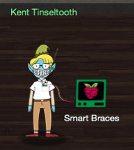

# Kent Tinseltooth - Smart Braces
{: .elf_avatar}

**Objective**: [Open the Sleigh Shop Door](../objectives/o11.md)

## Request
> OK, this is starting to freak me out!  
> Oh sorry, I'm Kent Tinseltooth. My Smart Braces are acting up.  
> Do... Do you ever get the feeling you can hear things? Like, voices?  
> I know, I sound crazy, but ever since I got these... Oh!  
> Do you think you could take a look at my Smart Braces terminal?  
> I'll bet you can keep other students out of my head, so to speak.  
> It might just take a bit of Iptables work.

## Video
<div class="video-wrapper">
<iframe width="560" height="315" src="https://www.youtube.com/embed/0hpKaJUhUMg" frameborder="0" allow="accelerometer; autoplay; encrypted-media; gyroscope; picture-in-picture" allowfullscreen></iframe>
</div>

## Resources
- [How to configure iptables on CentOS](https://upcloud.com/community/tutorials/configure-iptables-centos/)

## Solution
The challenge starts off with a conversation between Kent and a mysterious voice his head. It doesn't provide any real tips or hints except maybe for a little bit of context and a mention of the `srf.elfu.org` domain which we'll be using in [objective 12](../objectives/o12.md).


`/home/elfuuser/IOTteethBraces.md` contains the firewall configuration for the Smart Braces:

1. Set the default policies to DROP for the INPUT, FORWARD, and OUTPUT chains.
2. Create a rule to ACCEPT all connections that are ESTABLISHED,RELATED on the INPUT and the OUTPUT chains.
3. Create a rule to ACCEPT only remote source IP address 172.19.0.225 to access the local SSH server (on port 22).
4. Create a rule to ACCEPT any source IP to the local TCP services on ports 21 and 80.
5. Create a rule to ACCEPT all OUTPUT traffic with a destination TCP port of 80.
6. Create a rule applied to the INPUT chain to ACCEPT all traffic from the lo interface.


Set up the following iptables rules to match the required configuration:

```shell
sudo iptables -P INPUT DROP
sudo iptables -P FORWARD DROP
sudo iptables -P OUTPUT DROP
sudo iptables -A INPUT -m state --state ESTABLISHED,RELATED -j ACCEPT
sudo iptables -A OUTPUT -m state --state ESTABLISHED,RELATED -j ACCEPT
sudo iptables -A INPUT -s 172.19.0.225 -p tcp --dport 22 -j ACCEPT
sudo iptables -A INPUT -p tcp --dport 21 -j ACCEPT
sudo iptables -A INPUT -p tcp --dport 80 -j ACCEPT
sudo iptables -A OUTPUT -p tcp --dport 80 -j ACCEPT
sudo iptables -A INPUT -i lo -j ACCEPT
```


That's it! Firewall rules applied and inner peace for Kent achieved!

## Answer
See [solution](#solution).

## Hint
> Oh thank you! It's so nice to be back in my own head again. Er, alone.  
> By the way, have you tried to get into the crate in the Student Union? It has an interesting set of locks.  
> There are funny rhymes, references to perspective, and odd mentions of eggs!  
> And if you think the stuff in your browser looks strange, you should see the page source...  
> Special tools? No, I don't think you'll need any extra tooling for those locks.  
> BUT - I'm pretty sure you'll need to use [Chrome's developer tools](https://developers.google.com/web/tools/chrome-devtools) for that one.  
> Or sorry, you're a [Firefox fan](https://developer.mozilla.org/en-US/docs/Tools)?  
> Yeah, [Safari's fine too](https://developer.apple.com/safari/tools/) - I just have an ineffible hunger for a physical Esc key.  
> [Edge](https://docs.microsoft.com/en-us/microsoft-edge/devtools-guide/console)? That's cool. Hm? No no, I was thinking of an unrelated thing.  
> [Curl fan](https://curl.haxx.se/docs/manpage.html)? Right on! Just remember: the Windows one doesn't like double quotes.  
> Old school, huh? Oh sure - I've got what you need [right here](https://xkcd.com/325/)...  
> And I hear the Holiday Hack Trail game will give hints on the last screen if you complete it on Hard.  
