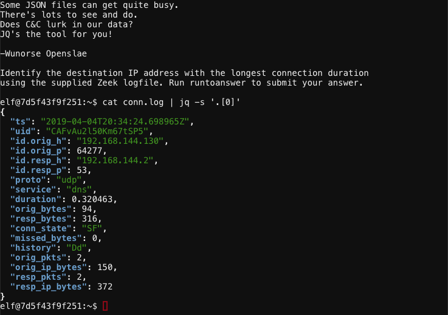
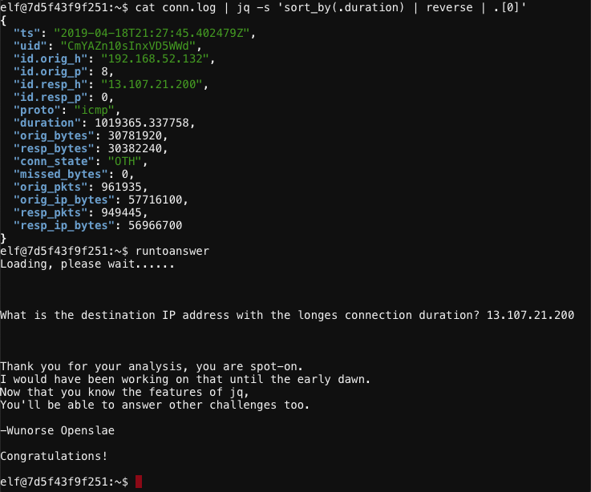

# Wunorse Openslae - Zeek JSON Analysis
{: .elf_avatar}

**Challenge**: [Filter Out Poisoned Data Sources](../challenges/c12.md)

## Request
> Wunorse Openslae here, just looking at some Zeek logs.  
> I'm pretty sure one of these connections is a malicious C2 channel...  
> Do you think you could take a look?  
> I hear a lot of C2 channels have very long connection times.  
> Please use jq to find the longest connection in this data set.  
> We have to kick out any and all grinchy activity!

## Video

<iframe width="560" height="315" src="https://www.youtube.com/embed/4CS02y-G5zA" frameborder="0" allow="accelerometer; autoplay; encrypted-media; gyroscope; picture-in-picture" allowfullscreen></iframe>

## Resources
- [Parsing Zeek JSON Logs with JQ](https://pen-testing.sans.org/blog/2019/12/03/parsing-zeek-json-logs-with-jq-2)

## Solution
Start by displaying a single log entry and its properties using `cat conn.log | jq -s '.[0]'`.

Looks like the `duration` field contains the information we need. Execute `cat conn.log | jq -s 'sort_by(.duration) | reverse | .[0]'` to reverse sort by `duration` and show the log entry matching the longest connection time.

The destination IP address with the longest connection duration is `13.107.21.200`.

## Answer
IP address: `13.107.21.200`

## Hint
> That's got to be the one - thanks!  
> Hey, you know what? We've got a crisis here.  
> You see, Santa's flight route is planned by a complex set of machine learning algorithms which use available weather data.  
> All the weather stations are reporting severe weather to Santa's Sleigh. I think someone might be forging intentionally false weather data!  
> I'm so flummoxed I can't even remember how to login!  
> Hmm... Maybe the Zeek http.log could help us.  
> I worry about [LFI](https://www.owasp.org/index.php/Testing_for_Local_File_Inclusion), [XSS](https://www.owasp.org/index.php/Cross-site_Scripting_(XSS)), and [SQLi](https://www.owasp.org/index.php/SQL_Injection) in the Zeek log - oh my!  
> And I'd be shocked if there weren't some [shell stuff](https://en.wikipedia.org/wiki/Shellshock_(software_bug)) in there too.  
> I'll bet if you pick through, you can find some naughty data from naughty hosts and block it in the firewall.  
> If you find a log entry that definitely looks bad, try pivoting off other unusual attributes in that entry to find more bad IPs.  
> The sleigh's machine learning device (SRF) needs most of the malicious IPs blocked in order to calculate a good route.  
> Try not to block many legitimate weather station IPs as that could also cause route calculation failure.  
> Remember, when looking at JSON data, jq is the tool for you!
