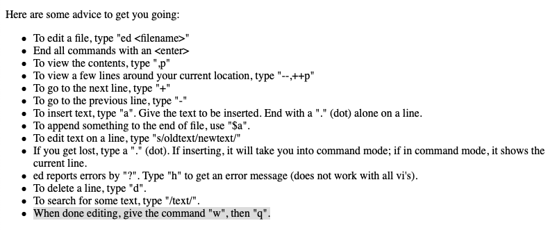
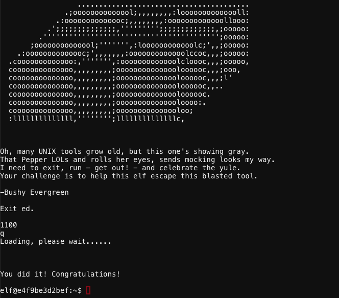

# Bushy Evergreen - "Escape Ed"
{: .elf_avatar}

**Challenge**: [Evaluate Attack Outcome](../challenges/c3.md)

## Request
> Hi, I'm Bushy Evergreen. Welcome to Elf U!  
> I'm glad you're here. I'm the target of a terrible trick.  
> Pepper Minstix is at it again, sticking me in a text editor.  
> Pepper is forcing me to learn ed.  
> Even the hint is ugly. Why can't I just use Gedit?  
> Please help me just quit the grinchy thing.  

## Resources
- [Ed Is The Standard Text Editor](http://cs.wellesley.edu/~cs249/Resources/ed_is_the_standard_text_editor.html) 

## Solution
The [Ed manual](http://cs.wellesley.edu/~cs249/Resources/ed_is_the_standard_text_editor.html) provides the answer on the first page.

Simply type `q` and press `<enter>` to exit the editor.

## Answer
Type `q` and press `<enter>`.

## Hint
> Wow, that was much easier than I'd thought.  
> Maybe I don't need a clunky GUI after all!  
> Have you taken a look at the password spray attack artifacts?  
> I'll bet that [DeepBlueCLI](https://github.com/sans-blue-team/DeepBlueCLI) tool is helpful.  
> You can check it out on GitHub.  
> It was written by that [Eric Conrad](https://www.ericconrad.com/2016/09/deepbluecli-powershell-module-for-hunt.html).  
> He lives in Maine - not too far from here!  
