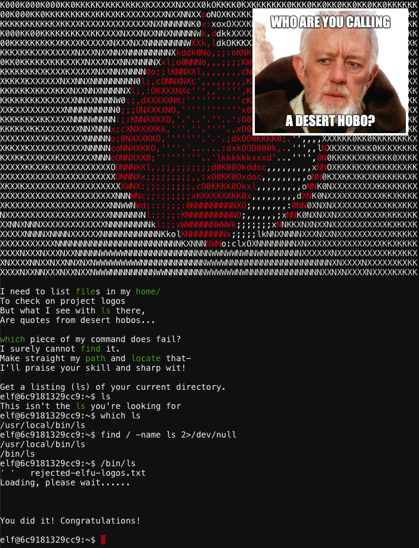

# SugarPlum Mary - Linux Path
{: .elf_avatar}

**Challenge**: [Determine Attacker Technique](../challenges/c4.md)

## Request
> Oh me oh my - I need some help!  
> I need to review some files in my Linux terminal, but I can't get a file listing.  
> I know the command is ls, but it's really acting up.  
> Do you think you could help me out? As you work on this, think about these questions:  
> 
> 1\. Do the words in green have special significance?  
> 2\. How can I find a file with a specific name?  
> 3\. What happens if there are multiple executables with the same name in my $PATH?  

## Resources
- *"Green words matter, files must be found, and the terminal's $PATH matters."* 

## Solution

When running a command without specifying the full path, the OS uses the list of paths stored in the `$PATH` environment variable to determine where the OS should look for executables. If multiple executables share the same name, the first binary that's found in the user's `$PATH` is the one that will be executed.

1. Use `which ls` to show the binary that's executed by default
2. Use `find / -iname ls 2>/dev/null` to search for any files matching the name 'ls' (and suppress errors).
3. The wrong `/usr/local/bin/ls` binary appears to be taking precedence over `/bin/ls`.
4. Simply run `/bin/ls` to solve the challenge.

## Answer
Execute `/bin/ls`.

## Hint
> Oh me oh my - I need some help!  
> Oh there they are! Now I can delete them. Thanks!  
> Have you tried the Sysmon and EQL challenge?  
> If you aren't familiar with Sysmon, [Carlos Perez](https://www.darkoperator.com/blog/2014/8/8/sysinternals-sysmon) has some great info about it.  
> Haven't heard of the Event Query Language?  
> Check out some of Ross Wolf's work on EQL or that [blog post by Josh Wright](https://pen-testing.sans.org/blog/2019/12/10/eql-threat-hunting/) in your badge.  
