# Sparkle Redberry - "Xmas Cheer Laser"
{: .elf_avatar}

Hint for: [Network Log Analysis - Determine Compromised System](../../challenges/c5/).

## Request
> I'm Sparkle Redberry and Imma chargin' my laser!  
> Problem is: the settings are off.  
> Do you know any PowerShell?  
> It'd be GREAT if you could hop in and recalibrate this thing.  
> It spreads holiday cheer across the Earth ...  
> ... when it's working!  

## Resources
- [SANS' PowerShell Cheat Sheet](https://blogs.sans.org/pen-testing/files/2016/05/PowerShellCheatSheet_v41.pdf) 

## Solution

Before we go over the solution I'd like to direct everyone's attention to the way Sparkle's running this whole laser experiment. Is there really no other option than pointing insanely intense laser beams at a snowman? I mean, what if [Jack Frost](../../#kringlecon-3-jack-frost) gets wind of this?

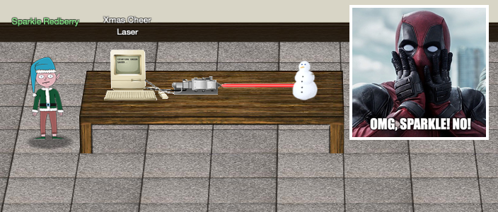

Anyway, the idea of the challenge is to use a series of PowerShell commands to find the right angle, temperature, refraction, and gas mixture parameters to correctly configure the Xmas Cheer Laser so it reaches 5 Mega-Jollies per liter of laser output. Prepare for a scavenger hunt because this challenge will take a while to get through. Let's start by reading the 'callingcard.txt' file.

```powershell
Get-Content /home/callingcard.txt
```

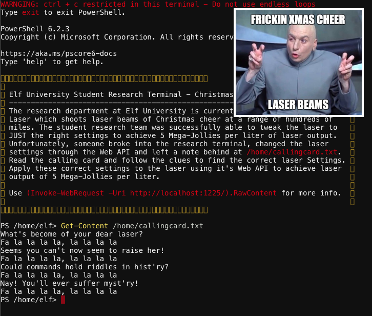

We do as the riddle suggests and show the command history using `Get-History`. By piping the output of the `Get-History` command to `out-string -Width 150` we make sure that long lines are completely visible (in this case we use width 150).

```powershell
Get-History | out-string -Width 150
```

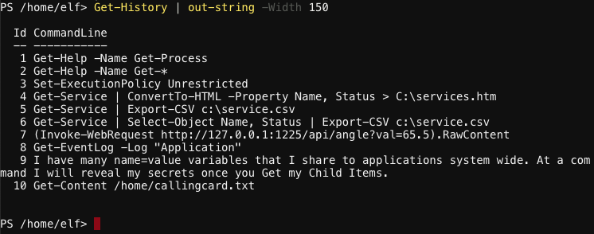

We found the correct laser angle value, `angle?val=65.5`, and a new hint which states *"I have many name=value variables that I share to applicatons system wide. At a command I will reveal my secrets once you Get my Child Items"*. Sounds like we're talking about environment variables so let's grab those.

```powershell
Get-ChildItem Env: | out-string -Width 300
```

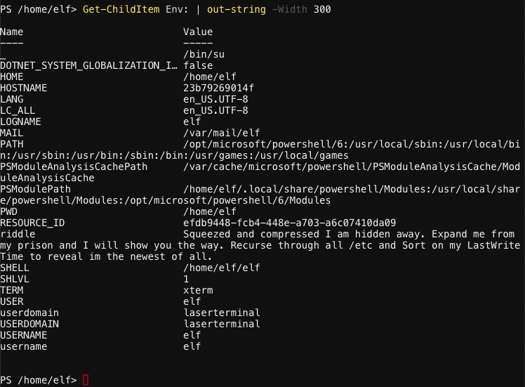

A new hint stored in the environment variable named `riddle` says *"Squeezed and compressed I am hidden away. Expand me from my prison and I will show you the way. Recurse through all /etc and Sort on my LastWriteTime to reveal im the newest of all."*. So we need to iterate over the `/etc` folder and find the file with the most recent `LastWriteTime` value. We also suppress any error output by setting `$ErrorActionPreference = ‘SilentlyContinue’`. Got to keep that command output sparkly clean.

```powershell
Get-ChildItem -Recurse -File /etc | `
    sort LastWriteTime -Descending -Top 1 | `
    select-object fullname,lastwritetime
```

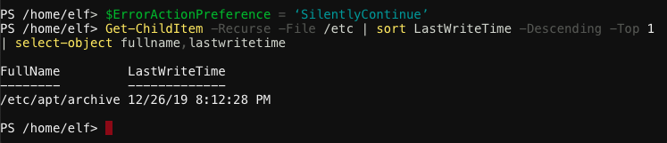

Looks like we found an archive at `/etc/apt/archive`. When we unpack this file to our home folder we find a 2 new files. One named `riddle` and what looks like an [ELF binary](https://en.wikipedia.org/wiki/Executable_and_Linkable_Format), an executable file format.

```powershell
Expand-Archive /etc/apt/archive -DestinationPath ./
```

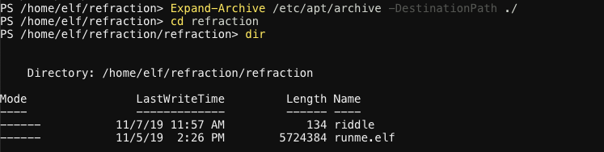

In order to execute the ELF binary we will first need to give it the appropriate execute permissions. This might seem confusing but note that we are running PowerShell on a Linux system which means that commands such as `chmod` should work as expected. So let's add user execute permissions (u+x) first and then run `runme.elf`.

```bash
chmod u+x ./runme.elf
./runme.elf
```

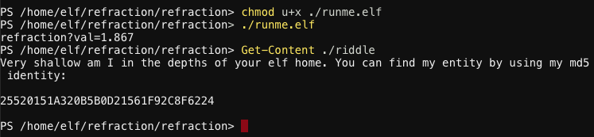

There's our second laser parameter, `refraction?val=1.867`, and yet another hint! *"Very shallow am I in the depths of your elf home. You can find my entity by using my md5 identity: 25520151A320B5B0D21561F92C8F6224"*. The folder named `depth` contains a ton of nested folder and files. Let's use the following PowerShell command to iterate through them and find the path of the file that matches MD5 25520151A320B5B0D21561F92C8F6224. Just like on *NIX system we pipe together different commands.

```powershell
Get-ChildItem -Recurse -File ./ | `
    Get-FileHash -Algorithm MD5 | `
    Where-Object hash -eq 25520151A320B5B0D21561F92C8F6224 | `
    Select path
```

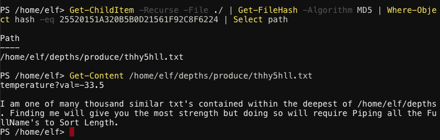

Huzzah! Looks like we just found the correct laser temperature, `temperature?val=-33.5`. Our latest hint reads *"I am one of many thousand similar txt's contained within the deepest of /home/elf/depths. Finding me will give you the most strength but doing so will require Piping all the FullName's to Sort Length."*. We need to find the file in our home folder with the longest FullName (i.e. path + filename). Note the long width value to ensure the full path is visible.

```powershell
Get-ChildItem -Recurse ./ | `
    Select-Object -Property FullName | `
    Sort-Object -Property {$_.FullName.Length} | `
    Select-Object -Last 1 | `
    out-string -Width 500
```

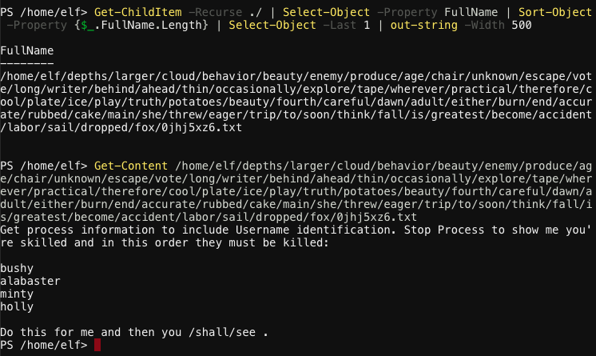

Surprise, another hint! *"Get process information to include Username identification. Stop Process to show me you're skilled and in this order they must be killed: bushy, alabaster, minty, holly. Do this for me and then you /shall/see"*. So we need to first list all processes with their user information and then kill the processes in the order requested. We can use the following two PowerShell commands for this. Be sure to replace `$process_id` with the correct process ID.

```powershell
Get-Process -IncludeUserName
Stop-Process -Id $process_id
```

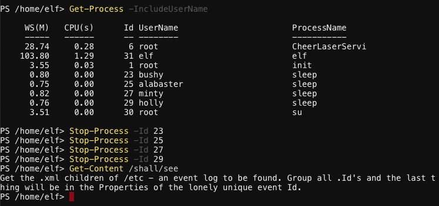

Once the processes are killed in the correct order a file named `/shall/see` will be created which contains the next hint. *"Get the .xml children of /etc - an event log to be found. Group all .Id's and the last thing will be in the Properties of the lonely unique event Id."*. First we need to find all XML files under `/etc/`. 

```powershell
Get-Childitem –Path /etc -Include *.xml -File -Recurse
```

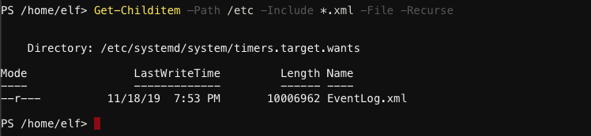

Per the previous hint we need to group all entries in the event log by their event ID and then find the one entry with a unique ID value. Once we've identified the correct ID value we need to retrieve its properties. We can use the following two PowerShell commands.

```powershell
Import-Clixml /etc/systemd/system/timers.target.wants/EventLog.xml | `
    Group-Object -Property ID -NoElement | `
    Sort-Object -Property Count -Descending
Import-Clixml /etc/systemd/system/timers.target.wants/EventLog.xml | `
    Where-Object {$_.ID -eq 1}
```

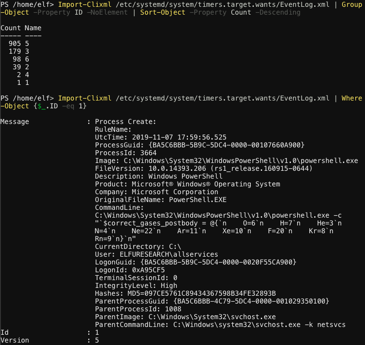

Looks like we just found the correct gas mixture, `O=6,H=7,He=3,N=4,Ne=22,Ar=11,Xe=10,F=20,Kr=8,Rn=9`. We now have all the values we need to correctly configure the Xmas Cheer Laser. Start by turning off the laser and configuring the correct angle, refraction, and temperature.

```powershell
(Invoke-WebRequest -Uri http://localhost:1225/api/off).RawContent
(Invoke-WebRequest -Uri http://127.0.0.1:1225/api/angle?val=65.5).RawContent
(Invoke-WebRequest -Uri http://127.0.0.1:1225/api/refraction?val=1.867).RawContent
(Invoke-WebRequest -Uri http://127.0.0.1:1225/api/temperature?val=-33.5).RawContent
```

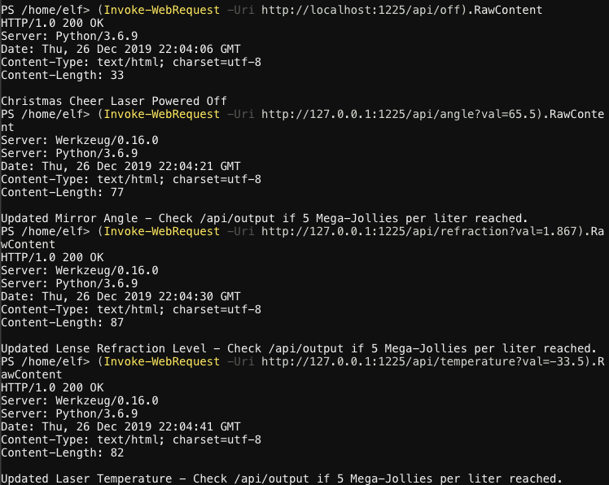

Next we configure the correct gas mixture by defining the POST request body as a variable and then using the variable in the actual HTTP request. All that's left is to turn the laser on and verify we reached the required 5 Mega-Jollies per liter of laser output.

```powershell
$correct_gases_postbody = @{O=6;H=7;He=3;N=4;Ne=22;Ar=11;Xe=10;F=20;Kr=8;Rn=9}
(Invoke-WebRequest -Uri http://127.0.0.1:1225/api/gas -Method POST -Body $correct_gases_postbody).RawContent
(Invoke-WebRequest -Uri http://localhost:1225/api/on).RawContent
(Invoke-WebRequest http://127.0.0.1:1225/api/output).RawContent
```

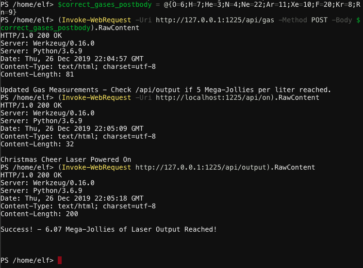

Woaa, a whoppin' 6.07 Mega-Jollies! Time to spread some Xmas cheer! But seriously, think of the snowman.


## Answer
- Angle: `65.5`
- Refraction: `1.867`
- Temperature: `-33.5`
- Gas mixture: `O=6,H=7,He=3,N=4,Ne=22,Ar=11,Xe=10,F=20,Kr=8,Rn=9`

## Hint
> You got it - three cheers for cheer!  
> For objective 5, have you taken a look at our Zeek logs?  
> Something's gone wrong. But I hear someone named [Rita](https://www.activecountermeasures.com/free-tools/rita/) can help us.  
> Can you and she figure out what happened?  
