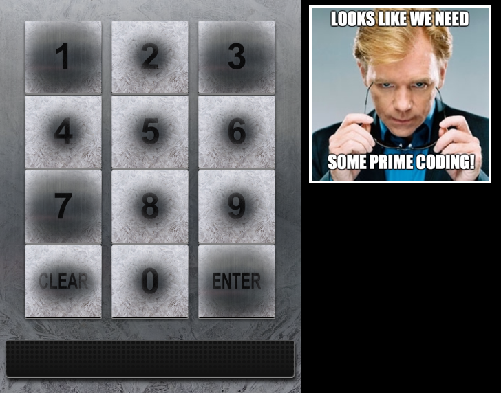
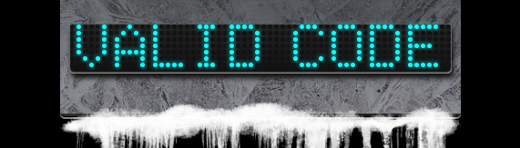

# Tangle Coalbox - Frosty Keypad
{: .elf_avatar}

**Objective**: [Splunk](../objectives/o6.md)

## Request
> Hey kid, it's me, Tangle Coalbox.  
> I'm sleuthing again, and I could use your help.  
> Ya see, this here number lock's been popped by someone.  
> I think I know who, but it'd sure be great if you could open this up for me.  
> I've got a few clues for you. 
>  
> 1\. One digit is repeated once.  
> 2\. The code is a prime number.  
> 3\. You can probably tell by looking at the keypad which buttons are used.  

## Video
<div class="video-wrapper">
<iframe width="560" height="315" src="https://www.youtube.com/embed/gTlCl6FR_0Q" frameborder="0" allow="accelerometer; autoplay; encrypted-media; gyroscope; picture-in-picture" allowfullscreen></iframe>
</div>

## Resources
- *"One digit is repeated once, it's prime, and you can see which keys were used"*

## Solution


Based on the hints and the keypad image we see that 1, 3, 7, and 'enter' are the keys that are used most frequently. Since one of the 3 digits is also repeated once the total code has a length of 4. This limits the options to [permutations](https://en.wikipedia.org/wiki/Permutation) of the following 3 number sets: [1, 1, 3, 7], [1, 3, 3, 7], and [1, 3, 7, 7]. Finally our 4-digit number needs to be prime. To help solve this we can use the following `find-code.py` [Python script](../scripts/find_code.py.md).

```python
#!/usr/bin/env python3
"""KringleCon 2 - Frosty Keypad Hint."""
import itertools


def is_prime(number):
    """Verify if a number is a prime."""
    return 2 in [number, 2**number % number]


def main():
    """Execute."""
    digit_sets = [
        ['1', '1', '3', '7'],
        ['1', '3', '3', '7'],
        ['1', '3', '7', '7']
    ]

    primes = []

    for digits in digit_sets:
        for subset in itertools.permutations(digits):
            val = int(''.join(subset))
            if is_prime(val) and val not in primes:
                primes.append(val)
                print(f'{val} is a prime number')


if __name__ == "__main__":
    main()
```

The script generates a manageable list of 5 possible candidates.

```shell
1373 is a prime number
1733 is a prime number
3137 is a prime number
3371 is a prime number
7331 is a prime number
```



Looks like `7331` is the [correct code](https://www.youtube.com/watch?v=7uW47jWLMiY)!

## Answer
Code: `7331`

## Hint
> Yep, that's it. Thanks for the assist, gumshoe.  
> Hey, if you think you can help with another problem, [Prof. Banas](../objectives/o6.md) could use a hand too.  
> Head west to the other side of the quad into Hermey Hall and find him in the Laboratory.  
