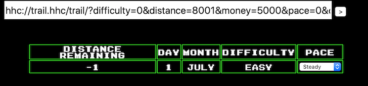

# Minty Candycane - "Holiday Hack Trail"
{: .elf_avatar}

Provides a hint for [Get Access to the Steam Tunnels](../../challenges/c7/).

## Request
> Hi! I'm Minty Candycane!  
> I just LOVE this old game!  
> I found it on a 5 1/4" floppy in the attic.  
> You should give it a go!  
> If you get stuck at all, check out this year's talks.  
> One is about web application penetration testing.  
> Good luck, and don't get dysentery!  

## Resources
- [Chris Elgee, Web Apps: A Trailhead](https://youtu.be/0T6-DQtzCgM) 

## Solution

Start by looking at the HTML source code for some hints about each difficulty level.

### Easy

To solve the challenge on 'easy' start the game, click on `easy`, then click on `buy` (no need to make any changes to your inventory), change the `distance` parameter in the URL to whatever value covers the remaining distance, and press `<enter>`.

On the next screen the `distance` value should have decreased.

Now press the `Go` button.

Tadaaaa! *"Your party has succeeded!"*

### Medium

Solving the challenge on 'medium' really isn't all that different. Instead of manipulating the `distance` in the URL we now change the `distance` value in the HTML body. Click on `medium`, then click the `buy` button, open up your browser's developer tools, and edit the value of the input tag named `distance`.

Press the `Go` button.

And once again, *"Your party has succeeded!"*

## Answer
- Easy: change the `distance` parameter in the URL.
- Medium: change the `distance` value in the HTML body.

## Hint
> You made it - congrats!  
> Have you played with the key grinder in my room? Check it out!  
> It turns out: if you have a good [image of a key](https://github.com/deviantollam/decoding), you can [physically copy it](https://youtu.be/KU6FJnbkeLA).  
> Maybe you'll see someone hopping around with a key here on campus.  
