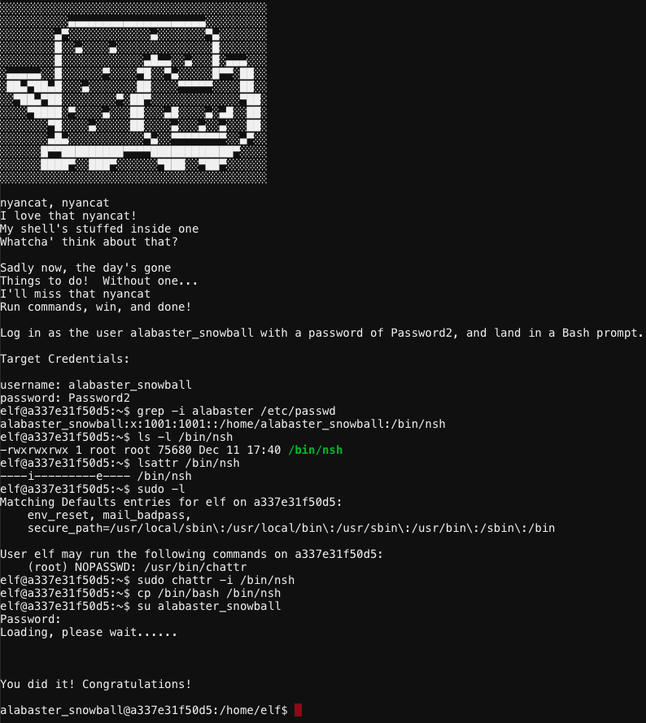

# Alabaster Snowball - "Nyanshell"
{: .elf_avatar}

Hint for: [Bypassing the Frido Sleigh CAPTEHA](../../challenges/c8/)

## Request
> Welcome to the Speaker UNpreparedness Room!  
> My name's Alabaster Snowball and I could use a hand.  
> I'm trying to log into this terminal, but something's gone horribly wrong.  
> Every time I try to log in, I get accosted with ... a hatted cat and a toaster pastry?  
> I thought my shell was Bash, not flying feline.  
> When I try to overwrite it with something else, I get permission errors.  
> Have you heard any chatter about immutable files? And what is sudo -l telling me?  

## Resources
- *"On Linux, a user's shell is determined by the contents of /etc/passwd"*  
- *"sudo -l says I can run a command as root. What does it do?"* 

## Solution

When you try to log in as Alabaster using `su alabaster_snowball` you'll end up with a Nyan cat animation you can't exit from. Follow the steps listed below to replace Alabaster's current shell with a copy of `/bin/bash`.

1. `grep -i alabaster /etc/passwd`: show Alabaster's default shell.
2. `ls -l /bin/nsh`: show file permissions. `-rwxrwxrwx` means anyone can read/write/execute.
3. `lsattr /bin/nsh`: show file attributes. `i` means the immutable flag is set.
4. `sudo -l`: show commands we can run with elevated privileges. In this case `sudo chattr`.
5. `sudo chattr -i /bin/nsh`: remove the immutable flag on `/bin/nsh` so it can be overwritten.
6. `cp /bin/bash /bin/nsh`: replace Nyan Shell with Bash.
7. `su alabaster_snowball`: log in as alabaster_snowball.
   
## Answer
See [solution](#solution).

## Hint
> Who would do such a thing?? Well, it IS a good looking cat.  
> Have you heard about the Frido Sleigh contest?  
> There are some serious prizes up for grabs.  
> The content is strictly for elves. Only elves can pass the CAPTEHA challenge required to enter.  
> I heard there was a talk at KCII about using [machine learning](https://youtu.be/jmVPLwjm_zs) to defeat challenges like this.  
> I don't think anything could ever beat an elf though!  
