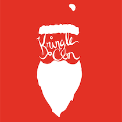

# TL;DR

## Introduction
{: .right}
Welcome to my write-up of the 2019 [SANS Holiday Hack Challenge](https://www.holidayhackchallenge.com/2019/) aka [KringleCon 2: Turtle Doves](https://kringlecon.com). After having such an awesome time helping Santa and all the Elves during KringleCon in 2018 I was super excited when an even bigger event was announcement for 2019. Elf University is one of the most renowned places on earth and a location I've always wanted to visit. No way I was going to miss this opportunity!

I was very honored to finish KringleCon with a [super honorable mention](https://www.holidayhackchallenge.com/2018/winners_answers.html) and while I initially only planned to help my festive friends at the North Pole out with a new series of exciting challenges I ultimately decided that I couldn't really skip submitting a write-up. Last year I went with a [PDF report](http://n00.be/files/CraHan%20-%20KringleCon%202018%20writeup.pdf) and this year I'm submitting both this [online write-up](http://fix-this-url) and a [series of videos](http://youtube.com/something) to help illustrate how I solved each of the main and hint challenges.

Thanks for taking the time to read through my write-up and I hope you gain something from it. If you have any questions, please feel free to ping me on [Twitter]([mailto:crahan-at-n00-dot-be](https://twitter.com/crahan)) or simply leave a comment on one of the videos.

## Answers
1. [Talk to Santa & Find the Turtle Doves](./challenges/c1/): `Student Union fireplace`
2. [Unredact Threatening Document](./challenges/c2/): `DEMAND`
3. [Windows Log Analysis - Evaluate Attack Outcome](./challenges/c3/): `supatree`
4. [Windows Log Analysis - Determine Attacker Technique](./challenges/c4/): `ntdsutil`
5. [Network Log Analysis - Determine Compromised System](./challenges/c5/): `192.168.134.130`
6. [Splunk](./challenges/c6/): `Kent you are so unfair. And we were going to make you the king of the Winter Carnival.`
7. [Get Access To The Steam Tunnels](./challenges/c7/): `Krampus Hollyfeld`
8. [Bypassing the Frido Sleigh CAPTEHA](./challenges/c8/): `8Ia8LiZEwvyZr2WO`
9. [Retrieve Scraps of Paper from Server](./challenges/c9/): `Super Sled-o-matic`
10. [Recover Cleartext Document](./challenges/c10/): `Machine Learning Sleigh Route Finder`
11. [Open the Sleigh Shop Door](./challenges/c11/): `The Tooth Fairy`
12. [Filter Out Poisoned Sources of Weather Data](./challenges/c12/): `0807198508261964`

!!! note "Note"
    *Talk to Santa in the Quad* and *Find the Turtle Doves* do not require any answers to be submitted as these objectives are there to set the stage, point you in the right direction, and ensure you visit all areas of Elf University. The write-up for both these objectives has been consolidated under a single entry titled *Talk to Santa & Find the Turtle Doves*.

## Elf University Map
[Click](./img/misc/map_large.png) for larger version.

## Full Narrative

> *Arrive*  
> Whose grounds these are, I think I know  
> His home is in the North Pole though  
> He will not mind me traipsing here  
> To watch his students learn and grow  
> 
> *Meet Santa*  
> Some other folk might stop and sneer  
> "Two turtle doves, this man did rear?"  
> I'll find the birds, come push or shove  
> Objectives given: I'll soon clear  
>
> *Doves Found*  
> Upon discov'ring each white dove,  
> The subject of much campus love,  
> I find the challenges are more  
> Than one can count on woolen glove.  
>
> *Strange Man*  
> Who wandered thus through closet door?  
> Ho ho, what's this? What strange boudoir!  
> Things here cannot be what they seem  
> That portal's more than clothing store.  
> 
> *Meet Krampus*  
> Who enters contests by the ream  
> And lives in tunnels meant for steam?  
> This Krampus bloke seems rather strange  
> And yet I must now join his team...  
>
> *CAPTEHA*  
> Despite this fellow's funk and mange  
> My fate, I think, he's bound to change.  
> What is this contest all about?  
> His victory I shall arrange!  
>
> *Decrypt Router HW Paper*  
> To arms, my friends! Do scream and shout!  
> Some villain targets Santa's route!  
> What scum - what filth would seek to end  
> Kris Kringle's journey while he's out?  
>
> *TF Plot Reveal*  
> Surprised, I am, but "shock" may tend  
> To overstate and condescend.  
> 'Tis little more than plot reveal  
> That fairies often do extend  
>
> *Problem Solver*  
> And yet, despite her jealous zeal,  
> My skills did win, my hacking heal!  
> No dental dealer can so keep  
> Our red-clad hero in ordeal!  
>
> *Cliff Hangers*  
> This Christmas must now fall asleep,  
> But next year comes, and troubles creep.  
> And Jack Frost hasn't made a peep,  
> And Jack Frost hasn't made a peep...

## KringleCon 3: Jack Frost
After thwarting the Tooth Fairy's dastardly plans and meeting up with Santa and Krampus at the top of the Bell Tower at Elf University you'll find a letter in the back left corner of the room. It appears that the Tooth Fairy wasn't working alone! Could this be a hint for 2020? Will we be facing off with Jack Frost at KringleCon 3? I'll guess we'll have to wait and see... *queue ominous music*.

