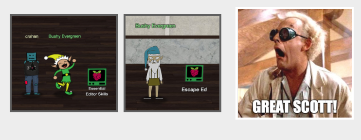

# Interesting UI Elements

## Epic Beard Craze

I'm not quite sure if it's because of the stress from all these KringleCon events or if there's some weird hipster craze hitting the North Pole, but some of these elves have gone through quite the transformation in the past year. Pretty epic facial hair, Bushy.



## Unused Elves

After searching for the avatar for Krampus as part of [objective 7](/objectives/o7/) I went back and looked at the rest of the elf avatars as some of the avatar images had a filename that matched the name of the elf (e.g. [mintycandycane.png](https://2019.kringlecon.com/images/avatars/elves/mintycandycane.png), [kent.png](https://2019.kringlecon.com/images/avatars/elves/kent.png)) while others used a more generic `elfX.png` file naming convention. Minty Candycane is also the only elf whose avatar looks the same as last year.

[elf15.png](https://2019.kringlecon.com/images/avatars/elves/elf15.png), the 6th elf from the left in the image below, is used as a generic image which is then replaced with the correct NPC's avatar. Probably a remnant from the development stages to ensure all NPCs showed up on screen, even if it was with a default image (this includes Santa himself). Worth noting is that not only do some of the Elf characters in the game use a generic `elfX.png` filename, there's also more elf avatar images available than are used in the game.


Unused elves, from left to right: [elf5.png](https://2019.kringlecon.com/images/avatars/elves/elf5.png), [elf6.png](https://2019.kringlecon.com/images/avatars/elves/elf6.png), [elf10.png](https://2019.kringlecon.com/images/avatars/elves/elf10.png), [elf11.png](https://2019.kringlecon.com/images/avatars/elves/elf11.png), [elf14.png](https://2019.kringlecon.com/images/avatars/elves/elf14.png), [elf15.png](https://2019.kringlecon.com/images/avatars/elves/elf15.png) (default NPC avatar), [elf17.png](https://2019.kringlecon.com/images/avatars/elves/elf17.png), [elf18.png](https://2019.kringlecon.com/images/avatars/elves/elf18.png), [elf19.png](https://2019.kringlecon.com/images/avatars/elves/elf19.png), [elf20.png](https://2019.kringlecon.com/images/avatars/elves/elf20.png), [elf21.png](https://2019.kringlecon.com/images/avatars/elves/elf21.png), and [elf22.png](https://2019.kringlecon.com/images/avatars/elves/elf22.png). In some cases the CSS also references the generic PNG files with an actual Elf name, even when the Elf doesn't make an appearance in the game. This is the case for both [elf10.png](https://2019.kringlecon.com/images/avatars/elves/elf10.png) aka Morcel Nougat and [elf11.png](https://2019.kringlecon.com/images/avatars/elves/elf11.png) aka Elinor Twinkletoes, two characters from last year's KringleCon event who seem to have hitched a ride in this year's CSS file.

```css
.viewport .ent.npc.npc-morcelnougat .npc-avatar {
  background-image: url(/images/avatars/elves/elf10.png); }

.viewport .ent.npc.npc-elinoretwinkletoes .npc-avatar {
  background-image: url(/images/avatars/elves/elf11.png); }
```

## Toy & Elf Soldiers

Another group of avatars that tagged along from the previous event are toy and elf soldiers, 6 color variants for each set. I guess Santa must've thought it would be good to have a handful of muscle at the ready just in case. Luckily it wasn't needed this time around and we were able to apprehend the Tooth Fairy without a show of force.


Toy Soldiers CSS:

```css
.viewport .ent.npc.npc-toysoldier1 .npc-avatar {
  background-image: url(/images/avatars/soldiers/kc18_soldiers_blue_2.png); }

.viewport .ent.npc.npc-toysoldier2 .npc-avatar {
  background-image: url(/images/avatars/soldiers/kc18_soldiers_green_3.png); }

.viewport .ent.npc.npc-sysoldier3 .npc-avatar {
  background-image: url(/images/avatars/soldiers/kc18_soldiers_orange_2.png); }

.viewport .ent.npc.npc-toysoldier4 .npc-avatar {
  background-image: url(/images/avatars/soldiers/kc18_soldiers_pink_1.png); }

.viewport .ent.npc.npc-toysoldier5 .npc-avatar {
  background-image: url(/images/avatars/soldiers/kc18_soldiers_red_2.png); }

.viewport .ent.npc.npc-toysoldier6 .npc-avatar {
  background-image: url(/images/avatars/soldiers/kc18_soldiers_red_3.png); }
```

Elf Soldiers CSS:

```css
.viewport .ent.npc.npc-elfsoldier1 .npc-avatar {
  background-image: url(/images/avatars/reveal/kc18_soldiers2_blue_2.png); }

.viewport .ent.npc.npc-elfsoldier2 .npc-avatar {
  background-image: url(/images/avatars/reveal/kc18_soldiers2_green_3.png); }

.viewport .ent.npc.npc-elfsoldier3 .npc-avatar {
  background-image: url(/images/avatars/reveal/kc18_soldiers2_orange_2.png); }

.viewport .ent.npc.npc-elfsoldier4 .npc-avatar {
  background-image: url(/images/avatars/reveal/kc18_soldiers2_pink_1.png); }

.viewport .ent.npc.npc-elfsoldier5 .npc-avatar {
  background-image: url(/images/avatars/reveal/kc18_soldiers2_red_2.png); }

.viewport .ent.npc.npc-elfsoldier6 .npc-avatar {
  background-image: url(/images/avatars/reveal/kc18_soldiers2_red_3.png); }
```

## Netwars Krampus

The CSS also references a version of Krampus which, based on the `.npc-krampus-netwars` class name used, should appear in the Netwars room. Either I didn't trigger the right series of events while playing the game or this code wasn't actually used. `.npc-krampus-steamtunnel`, `.npc-krampus-sleighroom` and `.npc-krampus-lastroom` refer to the different instances of Krampus you talk to, except for the version of Krampus that appears to scamper away in Minty's dorm room, which uses a different type of CSS styling. Just like the other CSS classes it uses the same [high-res Krampus avatar](https://2019.kringlecon.com/images/avatars/elves/krampus.png) background image and the only difference is the location string in the CSS class name.

```css
.viewport .ent.npc.npc-krampus-netwars .npc-avatar {
  width: 100px;
  height: 188px;
  background: url(/images/avatars/elves/krampus.png) no-repeat;
  background-size: auto 200px;
  background-position: 6px 3px; }
```

## Dorm Access Code


Not quite sure why Tangle Coalbox was having issues with the keypad code in the [Frosty Keypad](/hints/h6/) terminal hint as he could've probably just peered through the windows and see that the actual code, `7331`, is written on the left side of the dorm wall. Looks like we also have some Doctor Who fans at Elf University judging by the [TARDIS](https://en.wikipedia.org/wiki/TARDIS) drawn around the second door from the left.

## Golden Tickets


Two of the elves in the Netwars room, the elf sitting at the top left and the second elf from the right at the bottom right table, look like they're paying more attention to the [golden ticket](https://en.wikipedia.org/wiki/Charlie_and_the_Chocolate_Factory) on their [laptop screens](https://2019.kringlecon.com/textures/lappys.png) than the actual Netwars Continuous training. Not quite sure if they're busy designing those tickets or if they just won them, but they might want to focus a little more on the task at hand.

## Bag of Teeth, Literally


If you're like me and thought that white pile in the top right corner of the Elf Univesity Bell Tower was just a heap of snow then you might be unpleasantly surprised. It's actually, as the file name for the image texture puts it, [`quite-literally-a-huge-pile-of-teeth.png`](https://2019.kringlecon.com/textures/quite-literally-a-huge-pile-of-teeth.png). Say what you want about the Tooth Fairy, but that is one pretty impressive dental haul right there. 
