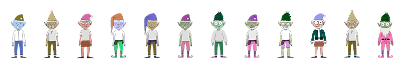
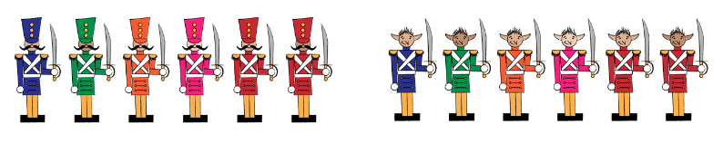
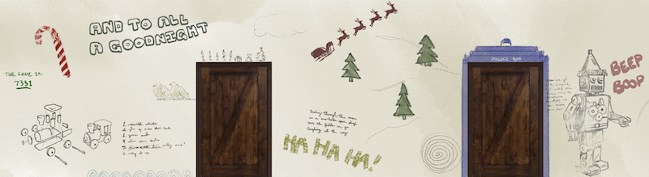
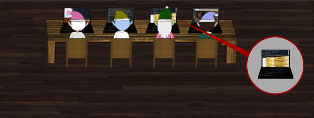
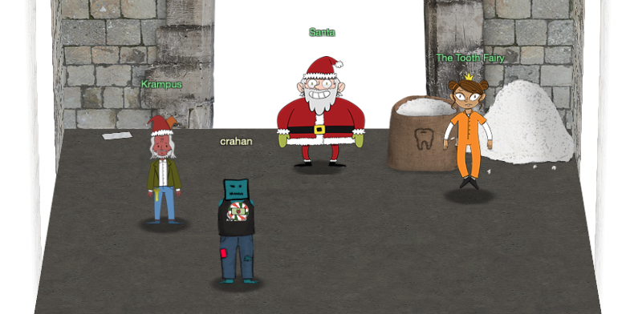

# Interesting UI Elements

## Unused Elves

After searching for the avatar for Krampus as part of [challenge 7](/challenges/c7/) I went back and looked at the rest of the elf avatars as some of the avatar images had a filename that matched the name of the elf (e.g. [mintycandycane.png](https://2019.kringlecon.com/images/avatars/elves/mintycandycane.png), [kent.png](https://2019.kringlecon.com/images/avatars/elves/kent.png)) while others used a more generic `elfX.png` file naming convention. Minty Candycane is also the only elf whose avatar looks the same as last year.

[elf15.png](https://2019.kringlecon.com/images/avatars/elf15.png), the 6th elf from the left in the image below, is used as a generic image which is then replaced with the correct NPC's avatar. Probably a remnant from the development stages to ensure all NPCs showed up on screen, even if it was with a default image (this includes Santa himself). Worth noting is that not only do some of the Elf characters in the game use a generic `elfX.png` filename, there's also more elf avatar images available than are used in the game.



Unused elves, from left to right: [elf5.png](https://2019.kringlecon.com/images/avatars/elves/elf5.png), [elf6.png](https://2019.kringlecon.com/images/avatars/elves/elf6.png), [elf10.png](https://2019.kringlecon.com/images/avatars/elves/elf10.png), [elf11.png](https://2019.kringlecon.com/images/avatars/elves/elf10.png), [elf14.png](https://2019.kringlecon.com/images/avatars/elves/elf14.png), [elf15.png](https://2019.kringlecon.com/images/avatars/elves/elf15.png) (default NPC avatar), [elf17.png](https://2019.kringlecon.com/images/avatars/elves/elf17.png), [elf18.png](https://2019.kringlecon.com/images/avatars/elves/elf18.png), [elf19.png](https://2019.kringlecon.com/images/avatars/elves/elf19.png), [elf20.png](https://2019.kringlecon.com/images/avatars/elves/elf20.png), [elf21.png](https://2019.kringlecon.com/images/avatars/elves/elf21.png), and [elf22.png](https://2019.kringlecon.com/images/avatars/elves/elf22.png). In some cases the CSS also references the generic PNG files with an actual Elf name, even when the Elf doesn't make an appearance in the game. This is the case for both [elf10.png](https://2019.kringlecon.com/images/avatars/elves/elf10.png) aka Morcel Nougat and [elf11.png](https://2019.kringlecon.com/images/avatars/elves/elf11.png) aka Elinor Twinkletoes, two characters from last year's KringleCon event who seem to have hitched a ride in this year's CSS file.

```
.viewport .ent.npc.npc-morcelnougat .npc-avatar {
  background-image: url(/images/avatars/elves/elf10.png); }

.viewport .ent.npc.npc-elinoretwinkletoes .npc-avatar {
  background-image: url(/images/avatars/elves/elf11.png); }
```

## Elf Soldiers

Another group of avatars that tagged along from the previous event are toy and elf soldiers (6 color variants of each). I guess Santa must've thought it would be good to have a handful of muscle at the ready just in case. Luckily it wasn't needed this time around and we were able to apprehend the Tooth Fairy without the use of force.



Toy Soldiers CSS classes and images:

- `.npc-toysoldier1`: [/images/avatars/soldiers/kc18_soldiers_blue_2.png](https://2019.kringlecon.com/images/avatars/soldiers/kc18_soldiers_blue_2.png)
- `.npc-toysoldier2`: [/images/avatars/soldiers/kc18_soldiers_green_3.png](https://2019.kringlecon.com/images/avatars/soldiers/kc18_soldiers_green_3.png)
- `.npc-toysoldier3`: [/images/avatars/soldiers/kc18_soldiers_orange_2.png](https://2019.kringlecon.com/images/avatars/soldiers/kc18_soldiers_orange_2.png)
- `.npc-toysoldier4`: [/images/avatars/soldiers/kc18_soldiers_pink_1.png](https://2019.kringlecon.com/images/avatars/soldiers/kc18_soldiers_pink_1.png)
- `.npc-toysoldier5`: [/images/avatars/soldiers/kc18_soldiers_red_2.png](https://2019.kringlecon.com/images/avatars/soldiers/kc18_soldiers_red_2.png)
- `.npc-toysoldier6`: [/images/avatars/soldiers/kc18_soldiers_red_3.png](https://2019.kringlecon.com/images/avatars/soldiers/kc18_soldiers_red_3.png)

Elf Soldiers CSS classes and images:

- `.npc-elfsoldier1`: [/images/avatars/reveal/kc18_soldiers2_blue_2.png](https://2019.kringlecon.com/images/avatars/reveal/kc18_soldiers2_blue_2.png)
- `.npc-elfsoldier2`: [/images/avatars/reveal/kc18_soldiers2_green_3.png](https://2019.kringlecon.com/images/avatars/reveal/kc18_soldiers2_green_3.png)
- `.npc-elfsoldier3`: [/images/avatars/reveal/kc18_soldiers2_orange_2.png](https://2019.kringlecon.com/images/avatars/reveal/kc18_soldiers2_orange_2.png)
- `.npc-elfsoldier4`: [/images/avatars/reveal/kc18_soldiers2_pink_1.png](https://2019.kringlecon.com/images/avatars/reveal/kc18_soldiers2_pink_1.png) 
- `.npc-elfsoldier5`: [/images/avatars/reveal/kc18_soldiers2_red_2.png](https://2019.kringlecon.com/images/avatars/reveal/kc18_soldiers2_red_2.png) 
- `.npc-elfsoldier6`: [/images/avatars/reveal/kc18_soldiers2_red_3.png](https://2019.kringlecon.com/images/avatars/reveal/kc18_soldiers2_red_3.png)

## Netwars Krampus

The CSS also references a version of Krampus which, based on the `.npc-krampus-netwars` class name used, should appear in the Netwars room. Either I didn't trigger the right series of events while playing the game or this code wasn't actually used. `.npc-krampus-steamtunnel`, `.npc-krampus-sleighroom` and `.npc-krampus-lastroom` refer to the different instances of Krampus you talk to, except for the version of Krampus that appears to scamper away in Minty's dorm room, which uses a different type of CSS styling. As with the other CSS classes, it uses the same [high-res Krampus avatar](https://2019.kringlecon.com/images/avatars/elves/krampus.png) and only differs in the location name used in the class name.

```
.viewport .ent.npc.npc-krampus-netwars .npc-avatar {
  width: 100px;
  height: 188px;
  background: url(/images/avatars/elves/krampus.png) no-repeat;
  background-size: auto 200px;
  background-position: 6px 3px; }
```

## Dorm Access Code



Not quite sure why Tangle Coalbox was having issues with accessing the dorm in the [Frosty Keypad](/hints/h6/) challenge  as he could've probably just peered through the windows and see that the actual code, `7331`, is written on the left side of the dorm wall. Looks like we also have some Doctor Who fans at Elf University judging by the [TARDIS](https://en.wikipedia.org/wiki/TARDIS) drawn around the second door from the left.

## Lucky Elf



The second Elf from the right at the bottom right table in the Netwars room looks like a real winner. If you download the [laptop image](https://2019.kringlecon.com/textures/lappys.png) you'll see that one of the laptop screens is displaying an  golden ticket and while other laptops are duplicated across some of the Netwars participants in the room, the laptop with the [golden ticket](https://en.wikipedia.org/wiki/Charlie_and_the_Chocolate_Factory) is used only once. Congratulations mystery Elf!


## Bag of Teeth, Literally



If you're like me and thought that white pile in the top right corner of the Elf Univesity Bell Tower was just a heap of snow then you might be unpleasantly surprised. It's actually, as the file name for the image texture puts it, [quite-literally-a-huge-pile-of-teeth](https://2019.kringlecon.com/textures/quite-literally-a-huge-pile-of-teeth.png). Say what you want about the Tooth Fairy, but that is one pretty impressive dental haul right there. 

## Jack Frost & KringleCon 3


The final entry of the narrative, the `.narrativeCliffHanger` CSS class for the final narrative entry, as well as the [final note](https://downloads.elfu.org/LetterOfWintryMagic.pdf) you find in the top left corner of the Elf University Bell Tower all hint at what might be in store for next year's KringleCon event. Jack Frost was apparently helping the Tooth Fairy. Cliff hanger indeed!

> This Christmas must now fall asleep,  
> But next year comes, and troubles creep.  
> And Jack Frost hasn't made a peep,  
> And Jack Frost hasn't made a peep...
