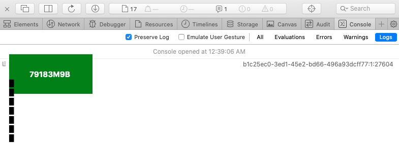
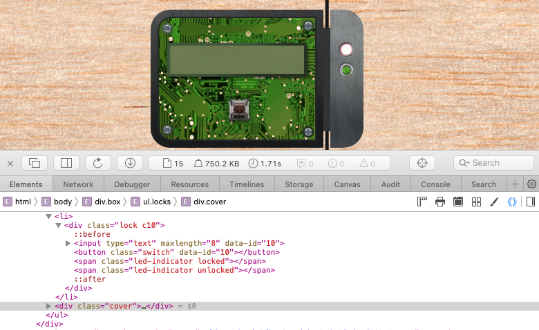

# Open the Sleigh Shop Door
**Terminal Hint**: [Kent Tinseltooth - Smart Braces](../hints/h11.md)

## Request
> Psst - hey!  
> I'm Shinny Upatree, and I know what's going on!  
> Yeah, that's right - guarding the sleigh shop has made me privvy to some serious, high-level intel.  
> In fact, I know WHO is causing all the trouble.  
> Cindy? Oh no no, not that who. And stop guessing - you'll never figure it out.  
> The only way you could would be if you could break into [my crate](https://crate.elfu.org/), here.  
> You see, I've written the villain's name down on a piece of paper and hidden it away securely!

## Video
<div class="video-wrapper">
<iframe width="560" height="315" src="https://www.youtube.com/embed/0hpKaJUhUMg?start=158" frameborder="0" allow="accelerometer; autoplay; encrypted-media; gyroscope; picture-in-picture" allowfullscreen></iframe>
</div>

## Resources
- [Crate](https://crate.elfu.org/)
- [Chrome Developer Tools](https://developers.google.com/web/tools/chrome-devtools)
- [Firefox Developer Tools](https://developer.mozilla.org/en-US/docs/Tools)
- [Safari Developer Tools](https://developer.apple.com/safari/tools/)
- [Edge Developer Tools](https://docs.microsoft.com/en-us/microsoft-edge/devtools-guide/console)
- [cURL Man Page](https://curl.haxx.se/docs/manpage.html)

## Solution
Time to whip out those browser developer tools and pick some HTML locks. Kent gives you a bunch of hints covering developer tools for just about every mainstream browser out there so you should be good. Unless you're a [Lynx user](https://xkcd.com/325/). Anyway, we need to bypass 10 of these bad boys which honestly feels like a little overkill for a crate that 'only' contains a piece of paper with a villain's name written on it. What other secrets are you hiding in that crate, Shinny?

### Lock 1
**Riddle**: *You don't need a clever riddle to open the console and scroll a little.*

Starting off nice and slow. Open the developer tools, go to the JavaScript console and scroll up. Quick sidenote, the lock codes are dynamically generated and, except for 1 or 2 exceptions, will most likely not be the same as the ones you will find when solving this objective. The final goal is accessing the crate though and not the codes themselves. 



**Answer**: `79183M9B`

### Lock 2
**Riddle**: *Some codes are hard to spy, perhaps they'll show up on pulp with dye?*

The `strong` tags inside the `libra` class are hidden via `display: none` but the code is visible in the HTML.


**Answer**: `UIZZC74T`

### Lock 3
**Riddle**: *This code is still unknown; it was fetched but never shown.*

The code can be found in an image resource that was downloaded but not displayed on the page.


**Answer**: `529P8GYF`

### Lock 4
**Riddle**: *Where might we keep the things we forage? Yes, of course: Local barrels!*

The code's in the local storage section of the developer tools. 


**Answer**: `V6K7BU0L`

### Lock 5
**Riddle**: *Did you notice the code in the title? It may very well prove vital.*

You'll find the code all the way to the right inside the `title` tags in the HTML header.


**Answer**: `A6YICRGB`

### Lock 6
**Riddle**: *In order for this hologram to be effective, it may be necessary to increase your perspective.*

Disable the `perspective` CSS property on the `hologram` class to reveal the code inside the hologram image.


**Answer**: `EBQQ4A47`

### Lock 7
**Riddle**: *The font you're seeing is pretty slick, but this lock's code was my first pick.*

Back to the `title` tags where the code is stored as a value of a `font-family` CSS property.


**Answer**: `IC9WA4PC`

### Lock 8
**Riddle**: *In the event that the .eggs go bad, you must figure out who will be sad.*

The `spoil` event listener on the `eggs` class leads to a JavaScript function with the code. 


**Answer**: `VERONICA`

### Lock 9
**Riddle**: *This next code will be unredacted, but only when all the chakras are :active.*

Select each `chakra` class and set it to active to reveal the code in between the riddle text.


**Answer**: `Y5EI2NGT`

### Lock 10
**Riddle**: *Oh, no! This lock's out of commission! Pop off the cover and locate what's missing.*

Unlike the previous 9 locks this one requires a little more work to solve. Start by dragging the `cover` div outside of the lock to uncover, pun intended, the circuitry. Removing the `cover` class from the div works as well but the drag option results in a cooler visual. In the bottom right hand corner, vertically, and in small print you'll find `KD29XJ37`.



Try entering the code and be greeted with an error in the JavaScript console, stating 'Error: Missing Macaroni!'. The problem is there's three different components, `macaroni` being one of them, missing inside the lock div.


Taking the long route, deobfuscate the JavaScript code to better understand what exactly it's trying to check inside of that `try/catch` block. One option is to use the developer tools JavaScript console to evaluate small pieces of the code. For example, entering `_0x3170('0x56')` in the console will print "Missing macaroni!". Rinse and repeat until the code becomes more readable.


```javascript
try {
    const _0xc468b6 = document["querySelector"](".locks > li > .lock.c10 > .component.macaroni");
    if (!_0xc468b6)
        throw Error("Missing macaroni!");
    _0xc468b6["attributes"]["data-code"]["value"];
    const _0x554445 = document["querySelector"](".locks > li > .lock.c10 > .component.swab");
    if (!_0x554445)
        throw Error("Missing cotton swab!");
    _0x554445["attributes"]["data-code"]["value"];
    const _0xd33ab7 = document["querySelector"](".locks > li > .lock.c10 > .component.gnome");
    if (!_0xd33ab7)
        throw Error("Missing gnome!");
    _0xd33ab7["attributes"]["data-code"]["value"];
    _0x39cbd(_0x47427d, {
        "id": _0x47427d,
        "code": _0x13fc35["value"]
    });
} catch (_0x262527) {
    console["error"](_0x262527);
}
```

It appears that the three components, defined as CSS classes, we're missing on this lock are `macaroni`, `swab`, and `gnome`. You will find 3 divs containing each of the required classes spread around the DOM. Fix things by dragging all of them inside of the lock div and you'll be able to open this final lock using the code `KD29XJ37`. Alternatively you can replace the `cover` class with `component macaroni swab gnome` and add a `data-code` parameter with a random value to the same div, but like before you'll miss out on some funny visuals.


Once all 10 locks have been opened the page displays Shinny Upatree's note. 


## Answer
Villain's name : `The Tooth Fairy`

## Hint
> Wha - what?? You got into my crate?!  
> Well that's embarrassing...  
> But you know what? Hmm... If you're good enough to crack MY security...  
> Do you think you could bring this all to a grand conclusion?  
> Please go into the sleigh shop and see if you can finish this off!  
> Stop the Tooth Fairy from ruining Santa's sleigh route!
