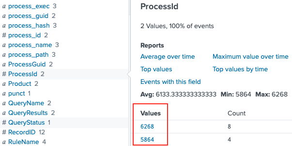

# Splunk
**Terminal Hint**: [Tangle Coalbox - Frosty Keypad](../hints/h6.md)

## Request
> Hi, I'm Dr. Banas, professor of Cheerology at Elf University.  
> This term, I'm teaching "HOL 404: The Search for Holiday Cheer in Popular Culture," and I've had quite a shock!  
> I was at home enjoying a nice cup of Gløgg when I had a call from Kent, one of my students who interns at the Elf U SOC.  
> Kent said that my computer has been hacking other computers on campus and that I needed to fix it ASAP!  
> If I don't, he will have to report the incident to the boss of the SOC.  
> Apparently, I can find out more information from this [website](https://splunk.elfu.org/) with the username: elf / Password: elfsocks.  
> I don't know anything about computer security. Can you please help me?

## Video
<div class="video-wrapper">
<iframe width="560" height="315" src="https://www.youtube.com/embed/gTlCl6FR_0Q?start=235" frameborder="0" allow="accelerometer; autoplay; encrypted-media; gyroscope; picture-in-picture" allowfullscreen></iframe>
</div>

## Resources
- [Elf University Splunk](https://splunk.elfu.org/)
- [Elf University File Archive](http://elfu-soc.s3-website-us-east-1.amazonaws.com)
- [James Brodsky, Dashing Through the Logs](https://www.youtube.com/watch?v=qbIhHhRKQCw)

## Solution
Jump to the solution for the [challenge question](#challenge-question).

### Training Question 1
*"What is the short host name of Professor Banas' computer?"*

The '#ELFU SOC' chat group has the answer to this question. Zippy mentions *"Yep. And we have some system called 'sweetums' here on campus communicating with the same weird IP"* to which Alice replies *"Gah... that's Professor Banas' system from over in the Polar Studies department"*. To find the answer using Splunk we can use the following query as well.

```shell
index=main user=cbanas | table _time user ComputerName
```


**Answer**: `sweetums`

### Training Question 2
*"What is the name of the sensitive file that was likely accessed and copied by the attacker? Please provide the fully qualified location of the file. (Example: C:\temp\report.pdf)"*

Similar to question 1, searching for a simple keyword can provide useful results. In this case we query for the string 'santa' to find an event containing a message from Santa to professor Banas referencing the text file `Naughty_and_Nice_2019_draft.txt`. 

```shell
index=main santa
```


**Answer**: `C:\Users\cbanas\Documents\Naughty_and_Nice_2019_draft.txt` 

!!! note "Note"
    The BASE64-encoded string found in this Splunk event decodes to a PowerShell script that tries to disable [script block logging](https://docs.splunk.com/Documentation/UBA/5.0.0/GetDataIn/AddPowerShell), downloads encrypted data from http://144.202.46[.]214:8080/admin/get.php (i.e. the command and control IP address found in [LISA](../objectives/o5.md)), decrypts it using an embedded key, and finally executes the decrypted code.

### Training Question 3
*"What is the fully-qualified domain name(FQDN) of the command and control(C2) server? (Example: badguy.baddies.com)"*

Search the collected Sysmon data for network connection activity (i.e. [Sysmon event ID 3](https://www.ultimatewindowssecurity.com/securitylog/encyclopedia/event.aspx?eventid=90003)) and add 'powershell' to narrow down the results. Use fields like `dest_host` and `DestinationHostname` in the left sidebar to show specific information.

```shell
index=main sourcetype="XmlWinEventLog:Microsoft-Windows-Sysmon/Operational" powershell EventCode=3
```


**Answer**: `144.202.46.214.vultr.com` 

### Training Question 4
*"What document is involved with launching the malicious PowerShell code? Please provide just the filename. (Example: results.txt)"*

Start by searching for all PowerShell activity by specifying the appropriate source and reverse the sort order so the oldest search results are at the top of the list. Click on the timestamp and in the popup dialog select a +/- five-second window. 

```shell
index=main sourcetype="WinEventLog:Microsoft-Windows-Powershell/Operational" | reverse
```


Now that we have all PowerShell activity in this 10-second timeframe we need to pivot to another source to find the associated process IDs. Powershell logs don't provide this information but Sysmon logs do so replace the PowerShell sourcetype with the one for Sysmon and look at the `process_id` or `ProcessId` fields.

```shell
index=main source="WinEventLog:Microsoft-Windows-Sysmon/Operational"
```



Now that we have two process IDs we need to determine what was responsible for spawning these PowerShell processes. Process creation events can be found in either Sysmon logs as [Sysmon event ID 1](https://www.ultimatewindowssecurity.com/securitylog/encyclopedia/event.aspx?eventid=90001) or in Windows logs as [Windows event ID 4688](https://www.ultimatewindowssecurity.com/securitylog/encyclopedia/event.aspx?eventid=4688). When searching for the latter, any process ID values need to be specified in hexadecimal. So, `5864` and `6268` have to be translated to `0x16E8` and `0x187C`. Be sure to set the search window to 'All time' again as the parent process for these PowerShell processes will most likely fall outside of the currently selected 10-second timeframe.

```shell
index=main sourcetype=WinEventLog EventCode=4688 (process_id=0x16e8 OR process_id=0x187c)
```


**Answer**: `19th Century Holiday Cheer Assignment.docm`

### Training Question 5
*"How many unique email addresses were used to send Holiday Cheer essays to Professor Banas? Please provide the numeric value. (Example: 1)"*

According to Alice *"You should be aware that Professor Banas was very clear in his instructions to his students: All assignment submissions must be made via email and must have the subject 'Holiday Cheer Assignment Submission'"*. As email addresses are not case sensitive we need to make sure we don't double-count any search results. Search stoQ logs for the correct subject line and count the number of results.

```shell
index=main sourcetype=stoq "results{}.workers.smtp.subject"="Holiday Cheer Assignment Submission" 
| stats count by results{}.workers.smtp.subject
```


**Answer**: `21`

### Training Question 6
*"What was the password for the zip archive that contained the suspicious file?"*

MITRE ATT&CK [Technique 1193](https://attack.mitre.org/techniques/T1193/) which Alice refers to is 'Spearphishing Attachment'. If the document is password protected then the attacker needs to let the victim know the password in order to open the document and execute the malicious code. In other words, we should be able to find a mention of it in the body of an email.

```shell 
index=main sourcetype=stoq "results{}.workers.smtp.body"=*password* 
| table results{}.workers.smtp.from results{}.workers.smtp.body
```


**Answer**: `123456789`

### Training Question 7
*"What email address did the suspicious file come from?"*

The answer is provided by exactly the same Splunk query we used for the previous question.

```shell 
index=main sourcetype=stoq "results{}.workers.smtp.body"=*password* 
| table results{}.workers.smtp.from results{}.workers.smtp.body
```


**Answer**: `bradly.buttercups@eifu.org`

### Challenge Question
*"What was the message for Kent that the adversary embedded in this attack?"*

Alice provides the initial Splunk query to get us started. stoQ will store any file metadata in Splunk but the raw artifact is uploaded to the [File Archive](http://elfu-soc.s3-website-us-east-1.amazonaws.com). Start by running Alice's query and look at the JSON output. The combination of `archivers.filedir.path` and `payload_meta.extra_data.filename` in the `results` array provides the path to each artifact in the Elf-U File Archive.

```shell
index=main sourcetype=stoq "results{}.workers.smtp.from"="bradly buttercups <bradly.buttercups@eifu.org>"
```


Next we extract the results array using [spath](https://docs.splunk.com/Documentation/Splunk/latest/SearchReference/Spath), loop over its items using [mvexpand](https://docs.splunk.com/Documentation/Splunk/latest/SearchReference/Mvexpand), and for each list item extract both `archivers.filedir.path` and `payload_meta.extra_data.filename` (again, using spath). To keep things clean we only show results where `archivers.filedir.path` is not an empty string.

```shell
index=main sourcetype=stoq "results{}.workers.smtp.from"="bradly buttercups <bradly.buttercups@eifu.org>" 
| eval results = spath(_raw, "results{}") 
| mvexpand results 
| eval path=spath(results, "archivers.filedir.path"),
       filename=spath(results, "payload_meta.extra_data.filename")
| search path!=""
| table filename, path
```


The obvious candidates for further investigation are `Buttercups_HOL404_assignment.zip` and `19th Century Holiday Cheer Assignment.docm` but both of these have been sanitized and contain a warning message. Luckily the .docm artifact also provides a hint about `core.xml`, stating *"The core.xml file that was a component of this original macro-enabled Word doc is still in this File Archive thanks to stoQ. Find it and you will be a happy elf :-)"*. Saves us some work of having to verify all remaining artifacts.


**Answer**: `Kent you are so unfair. And we were going to make you the king of the Winter Carnival.`

All of the 20 remaining documents, who submitted them, the associated File Archive link, and email message body can be retrieved using the below Splunk query. Looks like some of the elves spent just a little more time on this assignment than others.

```shell
index=main sourcetype=stoq "results{}.workers.smtp.subject"="Holiday Cheer Assignment Submission"
| eval results = spath(_raw, "results{}"), 
       from = spath(_raw, "results{}.workers.smtp.from"), 
       body = spath(_raw, "results{}.workers.smtp.body")
| mvexpand results 
| eval path=spath(results, "archivers.filedir.path"),
       filename=spath(results, "payload_meta.extra_data.filename")
| search filename="*.docx" OR filename="*.zip"
| table from, filename, path, body
```


## Answer
1. `sweetums`
2. `C:\Users\cbanas\Documents\Naughty_and_Nice_2019_draft.txt`
3. `144.202.46.214.vultr.com`
4. `19th Century Holiday Cheer Assignment.docm`
5. `21`
6. `123456789`
7. `bradly.buttercups@eifu.org`
8. `Kent you are so unfair. And we were going to make you the king of the Winter Carnival.`

## Response
> Oh, thanks so much for your help! Sorry I was freaking out.  
> I've got to talk to Kent about using my email again...  
> ...and picking up my dry cleaning.
